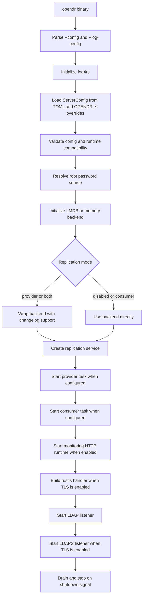
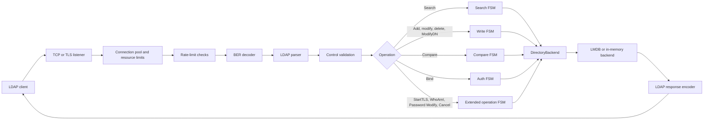
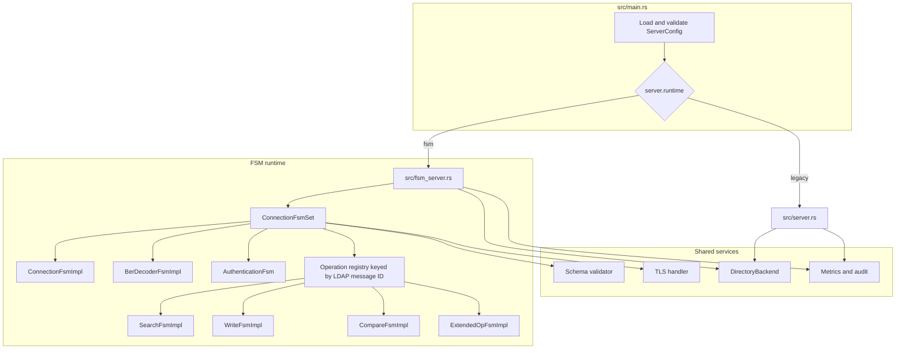
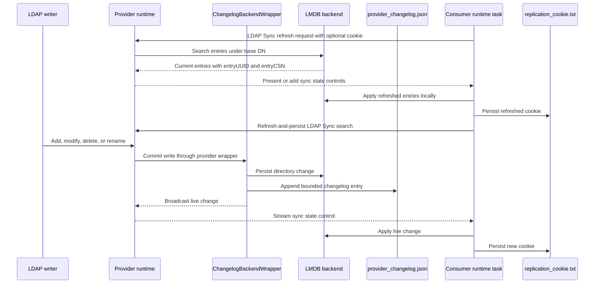

# OpenDR Architecture Overview

OpenDR is a Rust LDAPv3 server with two listener runtimes behind the same
`opendr` binary:

- `fsm`, the default and recommended runtime.
- `legacy`, the older runtime retained for compatibility and targeted behavior
  comparison.

The server entrypoint is `src/main.rs`. It loads configuration, initializes the
backend, starts replication services, starts monitoring, builds TLS state, and
dispatches LDAP and LDAPS listeners based on `server.runtime`.

## Startup Flow



## Request Flow



The FSM runtime creates a connection-level `ConnectionFsmSet` that owns:

- connection transport state
- BER decoder state
- authentication state
- operation FSMs correlated by LDAP message ID

Search, write, compare, and extended operations are independent FSM
implementations. Provider replication streams are served as LDAP Sync search
requests over the same server path.

## Runtime Composition



## Main Components

| Component | Files | Responsibility |
| --- | --- | --- |
| Entrypoint | `src/main.rs` | Runtime selection, backend setup, replication task startup, TLS, monitoring, shutdown |
| Configuration | `src/config.rs` | TOML/env loading, validation, defaults, secret resolution |
| Setup | `src/setup.rs`, `src/bin/setup.rs` | Interactive and non-interactive first-time setup |
| FSM listener | `src/fsm_server.rs`, `src/fsm_runtime.rs`, `src/fsm.rs` | Current listener path and operation FSM composition |
| Legacy listener | `src/server.rs` | Older listener path and shared protocol helpers |
| Backend | `src/backend.rs`, `src/backend_lmdb.rs` | Backend trait, in-memory test backend, LMDB backend |
| TLS | `src/tls.rs`, `src/connection_fsm.rs` | LDAPS and StartTLS transport upgrade |
| Replication | `src/replication*.rs`, `src/backend_changelog_wrapper.rs` | Provider changelog, LDAP Sync provider sessions, consumer state |
| Backup | `src/backup.rs`, `src/bin/opendr_backup.rs`, `src/bin/opendr_restore.rs` | LMDB full backup, changelog incremental backup, offline restore |
| Monitoring | `src/monitoring_runtime.rs`, `src/metrics.rs` | Prometheus metrics, JSON health, read-only console UI, and overview API |
| Audit and ACI | `src/audit.rs`, `src/aci.rs` | Security event logging and access-control engine |

## Runtime Selection

```toml
[server]
runtime = "fsm"
```

Use `fsm` for new deployments. It integrates shutdown, connection pooling,
resource limits, rate limiting, metrics, audit, TLS, and operation FSMs.

Use `legacy` only for compatibility checks or legacy-specific debugging. The
shipped binary rejects non-default `rate_limit.burst_size` when using `legacy`.

## Storage

The production backend is LMDB. It stores entries, password hashes, normalized
DN lookup, context metadata, and configured attribute indexes in separate LMDB
databases. Reads use LMDB multi-reader behavior and exact-DN entry/auth
credential caches. Writes use a backend write lock.

The in-memory backend is useful for tests and local experiments. It is not a
durable backend.

## Replication

OpenDR replication is listener-based LDAP Sync replication:

1. Provider writes are recorded through `ChangelogBackendWrapper`.
2. The provider stores a bounded changelog and broadcasts live changes.
3. A consumer performs an initial refresh from the provider.
4. The consumer persists a replication cookie.
5. The consumer keeps a refresh-and-persist search open for live updates.

Provider state is persisted in:

```text
<replication.state_storage_path>/provider_changelog.json
```

Consumer state is persisted in:

```text
<replication.state_storage_path>/replication_cookie.txt
```

Poll-based consumer replication has been removed. Consumer and both modes
require `enable_change_listening = true`.



## Operational Attributes

Backend writes maintain operational attributes such as:

- `entryCSN`
- `entryUUID`
- create and modify timestamps
- creators and modifiers names
- `contextCSN`

Operational attributes are hidden from normal search results unless the client
requests `+` or explicit operational attribute names.

## Known Implementation Boundaries

- FSM runtime simple bind, anonymous bind, and SASL PLAIN over confidential
  transport are wired. Other SASL mechanisms are not production-enabled.
- `access_control.rules_file` is parsed but not loaded by the shipped startup
  path.
- `performance.indexing_enabled` and `performance.cache_size` are wired into
  startup; other performance fields are parsed for forward compatibility.
- Restore applies incrementals with default LMDB index configuration; keep the
  runtime config aligned and allow startup index backfill for custom indexes.
- General multi-master conflict resolution is not implemented.
