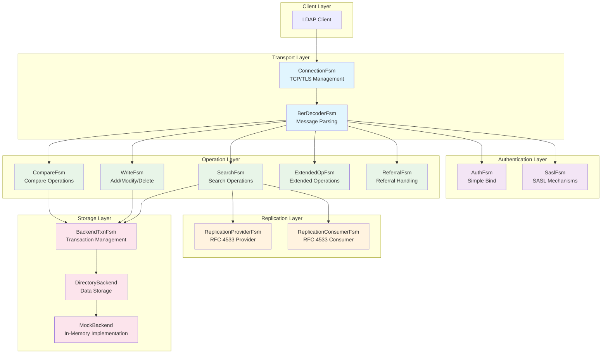
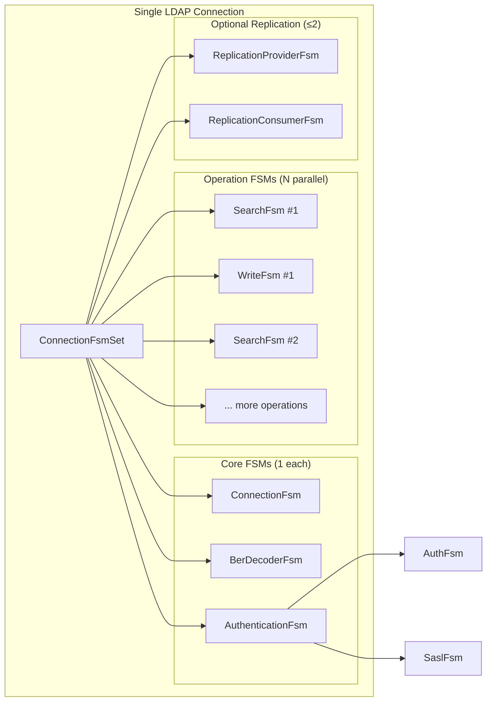
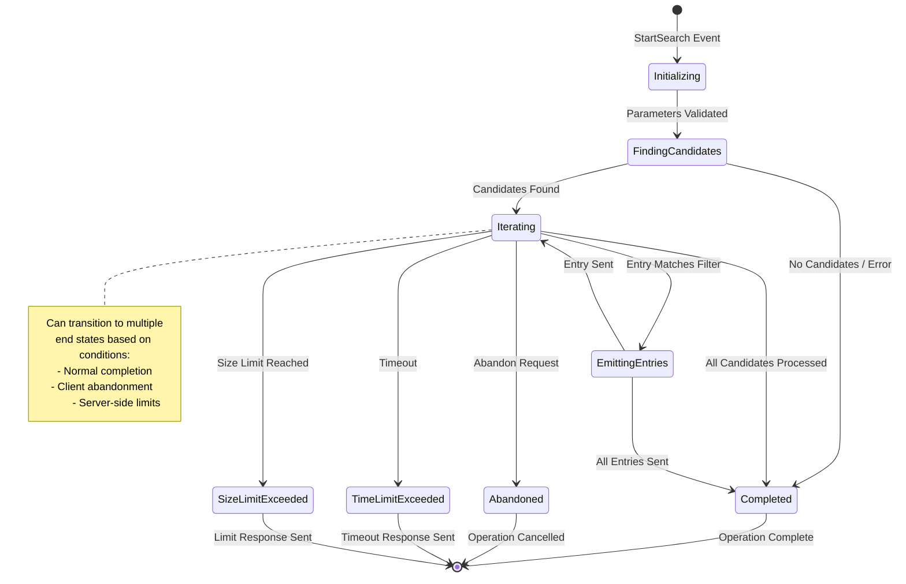
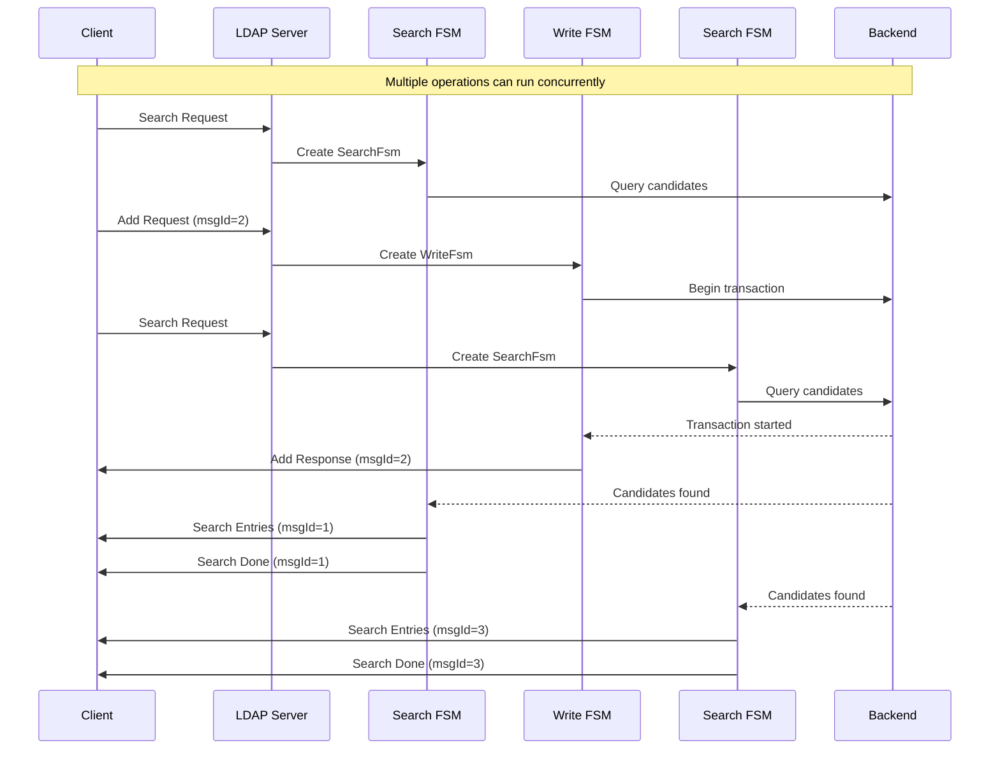

# LDAP Server Architecture Overview

This document provides a high-level architectural overview of the opendr LDAP server, focusing on the FSM-based design and component relationships.

## System Architecture Layers

## Connection Lifecycle and FSM Management

## FSM State Transition Example - Search Operation

## Concurrent Operation Flow

## Key Design Principles

### 1. **Separation of Concerns**
- **Transport**: Handle TCP/TLS and message framing
- **Authentication**: Manage session identity and authorization
- **Operations**: Execute LDAP protocol operations independently
- **Storage**: Provide transactional data access

### 2. **Concurrency Model**
- Each operation is an independent FSM instance
- Shared transport and authentication state
- Parallel operation execution with message ID correlation
- Backend transaction isolation

### 3. **State Management**
- Explicit state transitions through events
- Timeout and abandonment support
- Error state handling and recovery
- Terminal state enforcement

### 4. **Extensibility**
- Plugin architecture for new FSM types
- Backend abstraction for different storage engines
- Extended operation framework
- Replication protocol support

### 5. **Type Safety**
- Rust trait system ensures compile-time correctness
- Associated types for state/event/error specifications
- Dynamic dispatch through trait objects
- Memory safety without garbage collection

This architecture provides a solid foundation for implementing a production-ready LDAP server with enterprise features like replication, extended operations, and high concurrency.