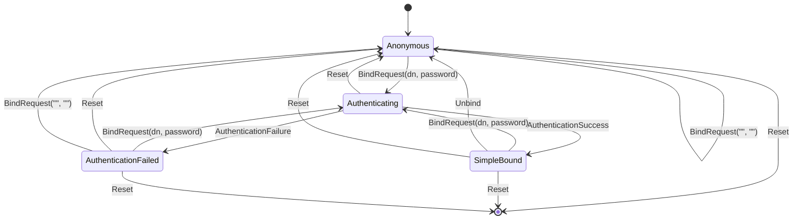

# Authentication FSM Documentation

## Overview

The Authentication FSM (Finite State Machine) is a core component of the opendr LDAP server that manages authentication state transitions for client connections. It implements the LDAP Simple Bind authentication protocol with support for anonymous binds, rate limiting, and comprehensive statistics tracking.

## Architecture

### State Machine Design

The Auth FSM follows the state machine pattern defined in `src/fsm.rs` and implements the `StateMachine` and `AuthFsm` traits. It provides type-safe state transitions and asynchronous event handling.

```rust
pub struct AuthFsmImpl {
    state: AuthState,                          // Current FSM state
    backend: Option<Box<dyn AuthenticationBackend>>, // Authentication backend
    config: AuthConfig,                        // Configuration settings
    user_info: Option<AuthUserInfo>,          // Current user information
    stats: AuthStats,                         // Authentication statistics
    auth_start_time: Option<Instant>,         // Authentication attempt timing
}
```

### States and Transitions

The Auth FSM manages four primary states:

1. **Anonymous** - No authentication, allows anonymous operations
2. **Authenticating** - Authentication in progress for a specific DN
3. **SimpleBound** - Successfully authenticated with Simple Bind
4. **AuthenticationFailed** - Authentication failed or blocked




### Event Types

The FSM handles five event types:

```rust
pub enum AuthEvent {
    BindRequest { dn: String, password: Vec<u8> },  // LDAP Bind request
    AuthenticationSuccess,                           // Backend auth success
    AuthenticationFailure,                           // Backend auth failure
    Unbind,                                         // LDAP Unbind request
    Reset,                                          // Reset FSM to initial state
}
```

## Core Components

### AuthenticationBackend Trait

The authentication backend provides the interface for credential verification and user information retrieval:

```rust
#[async_trait]
pub trait AuthenticationBackend: Send + Sync {
    async fn authenticate(&self, dn: &str, password: &[u8]) -> Result<bool, String>;
    async fn dn_exists(&self, dn: &str) -> Result<bool, String>;
    fn validate_dn(&self, dn: &str) -> Result<(), String>;
    async fn get_user_info(&self, dn: &str) -> Result<AuthUserInfo, String>;
}
```

### Configuration Options

```rust
pub struct AuthConfig {
    pub allow_anonymous: bool,      // Allow anonymous binds
    pub require_tls: bool,          // Require TLS for authentication
    pub max_auth_attempts: u32,     // Maximum failed attempts before blocking
    pub auth_timeout: Duration,     // Timeout for authentication operations
}
```

### Statistics Tracking

The FSM maintains comprehensive statistics for monitoring and debugging:

```rust
pub struct AuthStats {
    pub successful_auths: u64,      // Count of successful authentications
    pub failed_auths: u64,          // Count of failed authentications
    pub anonymous_binds: u64,       // Count of anonymous bind operations
    pub unbind_operations: u64,     // Count of unbind operations
    pub current_auth_attempts: u32, // Current session auth attempts
    pub session_start_time: Instant, // Session start time
}
```

### User Information

Successfully authenticated users have associated information:

```rust
pub struct AuthUserInfo {
    pub dn: String,                    // Distinguished Name
    pub display_name: Option<String>,  // Human-readable name
    pub email: Option<String>,         // Email address
    pub groups: Vec<String>,           // Group memberships
    pub last_login: Option<Instant>,   // Last login time
}
```

## Usage Examples

### Basic Usage

```rust
use opendr::auth_fsm::{AuthFsmImpl, AuthConfig};
use opendr::fsm::{StateMachine, AuthEvent, AuthFsm};

// Create FSM with default configuration
let mut auth_fsm = AuthFsmImpl::new();

// Anonymous bind
let result = auth_fsm.handle_event(AuthEvent::BindRequest {
    dn: "".to_string(),
    password: vec![],
}).await?;

println!("Authenticated: {}", auth_fsm.is_authenticated());
```

### With Custom Backend

```rust
let backend = Box::new(MyAuthBackend::new());
let mut auth_fsm = AuthFsmImpl::new().with_backend(backend);

// Simple bind
let _ = auth_fsm.handle_event(AuthEvent::BindRequest {
    dn: "cn=user,dc=example,dc=org".to_string(),
    password: b"password".to_vec(),
}).await?;

// Trigger authentication success (normally done by backend)
let user_info = auth_fsm.handle_event(AuthEvent::AuthenticationSuccess).await?;

if let Some(info) = user_info {
    println!("Authenticated as: {}", info.dn);
}
```

### Custom Configuration

```rust
let config = AuthConfig {
    allow_anonymous: false,
    require_tls: true,
    max_auth_attempts: 5,
    auth_timeout: Duration::from_secs(60),
};

let mut auth_fsm = AuthFsmImpl::with_config(config);
```

## Features

### Anonymous Bind Support

The FSM supports LDAP anonymous binds (empty DN and password):

```rust
// Anonymous bind - transitions to Anonymous state
let result = auth_fsm.handle_event(AuthEvent::BindRequest {
    dn: "".to_string(),
    password: vec![],
}).await?;
```

- Configurable via `AuthConfig.allow_anonymous`
- Tracks anonymous bind statistics
- Maintains anonymous auth level

### Rate Limiting

Built-in protection against brute force attacks:

- Configurable maximum authentication attempts
- Tracks attempts per session
- Blocks further attempts after limit exceeded
- Resets on successful authentication or explicit reset

### Authentication Timeout

Tracks authentication timing to detect slow or stalled operations:

```rust
// Check if current authentication has timed out
if auth_fsm.is_auth_timeout() {
    // Handle timeout condition
}
```

### Re-binding Support

The FSM supports re-binding (changing authentication while already authenticated):

```rust
// Initial authentication
let _ = auth_fsm.handle_event(AuthEvent::BindRequest {
    dn: "cn=user1,dc=example,dc=org".to_string(),
    password: b"password1".to_vec(),
}).await?;
let _ = auth_fsm.handle_event(AuthEvent::AuthenticationSuccess).await?;

// Re-bind as different user
let _ = auth_fsm.handle_event(AuthEvent::BindRequest {
    dn: "cn=user2,dc=example,dc=org".to_string(),
    password: b"password2".to_vec(),
}).await?;
let _ = auth_fsm.handle_event(AuthEvent::AuthenticationSuccess).await?;
```

## Error Handling

The FSM defines comprehensive error types:

```rust
pub enum AuthError {
    InvalidStateTransition { from: AuthState, to: AuthState },
    AuthenticationFailed { reason: String },
    InvalidCredentials,
    DirectoryError { message: String },
    Generic { message: String },
}
```

### Error Scenarios

1. **Invalid State Transitions** - Attempting invalid state changes
2. **Authentication Failures** - Backend authentication failures
3. **Rate Limiting** - Exceeding maximum authentication attempts
4. **Directory Errors** - Backend or directory service errors
5. **Configuration Errors** - Invalid configuration settings

## Integration with LDAP Server

The Auth FSM integrates with the main LDAP server in several ways:

### Connection Management

Each LDAP client connection maintains its own Auth FSM instance:

```rust
// In connection handler
let mut auth_fsm = AuthFsmImpl::new()
    .with_backend(directory_backend)
    .with_config(server_config.auth_config);
```

### LDAP Message Processing

LDAP Bind and Unbind messages trigger FSM events:

```rust
// Handle LDAP Bind Request
match ldap_message.message_type {
    LdapMessageType::BindRequest(bind_req) => {
        let result = auth_fsm.handle_event(AuthEvent::BindRequest {
            dn: bind_req.name,
            password: bind_req.authentication.simple(),
        }).await?;
        
        // Send appropriate LDAP response based on result
    }
    LdapMessageType::UnbindRequest => {
        auth_fsm.handle_event(AuthEvent::Unbind).await?;
    }
}
```

### Authorization Checks

Other LDAP operations check authentication status:

```rust
// Before processing LDAP operation
if !auth_fsm.is_authenticated() && requires_authentication(operation) {
    return send_ldap_error(LdapResultCode::InsufficientAccess);
}

// Get current user for authorization
if let Some(user_dn) = auth_fsm.authenticated_dn() {
    if !authorize_operation(user_dn, operation) {
        return send_ldap_error(LdapResultCode::InsufficientAccess);
    }
}
```

## Testing

The Auth FSM includes comprehensive unit tests covering:

- All state transitions
- Error conditions
- Rate limiting
- Statistics tracking
- Backend integration
- Configuration options

### Running Tests

```bash
# Run all Auth FSM tests
cargo test auth_fsm

# Run specific test
cargo test auth_fsm::tests::test_authentication_success
```

### Mock Backend

The test suite includes a `MockAuthBackend` for isolated testing:

```rust
let backend = Box::new(MockAuthBackend::new());
let mut auth_fsm = AuthFsmImpl::new().with_backend(backend);

// Test authentication with known credentials
let result = auth_fsm.handle_event(AuthEvent::BindRequest {
    dn: "cn=admin,dc=example,dc=org".to_string(),
    password: b"secret".to_vec(),
}).await;
```

## Examples

The `examples/auth_fsm_demo.rs` provides comprehensive usage examples:

```bash
# Run the demonstration
cargo run --example auth_fsm_demo
```

The demo includes:

- Anonymous bind demonstration
- Successful authentication flow
- Authentication failure handling
- Rate limiting demonstration
- Complete lifecycle management

## Performance Considerations

### Memory Usage

- Minimal memory footprint per connection
- User info cached after successful authentication
- Statistics maintained as simple counters

### Async Operations

- All authentication operations are asynchronous
- Non-blocking state transitions
- Backend operations can be parallelized

### Scalability

- Each connection maintains independent FSM state
- No shared state between connections
- Backend can implement connection pooling

## Security Considerations

### Password Handling

- Passwords stored as `Vec<u8>` for binary safety
- No plaintext password storage in FSM state
- Backend responsible for secure password verification

### Rate Limiting

- Per-connection rate limiting prevents brute force
- Configurable attempt limits and timeouts
- Failed attempts tracked persistently

### State Validation

- Strict state machine prevents invalid transitions
- Type-safe event handling
- Comprehensive error reporting

## Future Enhancements

### Planned Features

1. **SASL Authentication** - Support for SASL mechanisms
2. **Certificate-based Authentication** - X.509 certificate support
3. **Multi-factor Authentication** - Integration with MFA providers
4. **Audit Logging** - Detailed authentication event logging
5. **Metrics Integration** - Prometheus/StatsD metrics export

### Extension Points

The current architecture supports future extensions:

- Custom authentication backends
- Additional authentication levels
- Extended user information
- Custom rate limiting algorithms
- Integration with external identity providers

## API Reference

### Core Types

- `AuthFsmImpl` - Main FSM implementation
- `AuthConfig` - Configuration structure
- `AuthStats` - Statistics tracking
- `AuthUserInfo` - User information
- `AuthError` - Error types

### Traits

- `StateMachine` - Core state machine behavior
- `AuthFsm` - Authentication-specific methods
- `AuthenticationBackend` - Backend abstraction

### Methods

- `new()` - Create FSM with default config
- `with_config()` - Create FSM with custom config
- `with_backend()` - Set authentication backend
- `handle_event()` - Process FSM events
- `current_state()` - Get current state
- `is_authenticated()` - Check authentication status
- `authenticated_dn()` - Get authenticated user DN
- `auth_level()` - Get authentication level
- `stats()` - Get statistics
- `user_info()` - Get user information
- `reset()` - Reset FSM to initial state

This documentation provides a comprehensive overview of the Authentication FSM implementation, usage patterns, and integration guidelines for the opendr LDAP server.