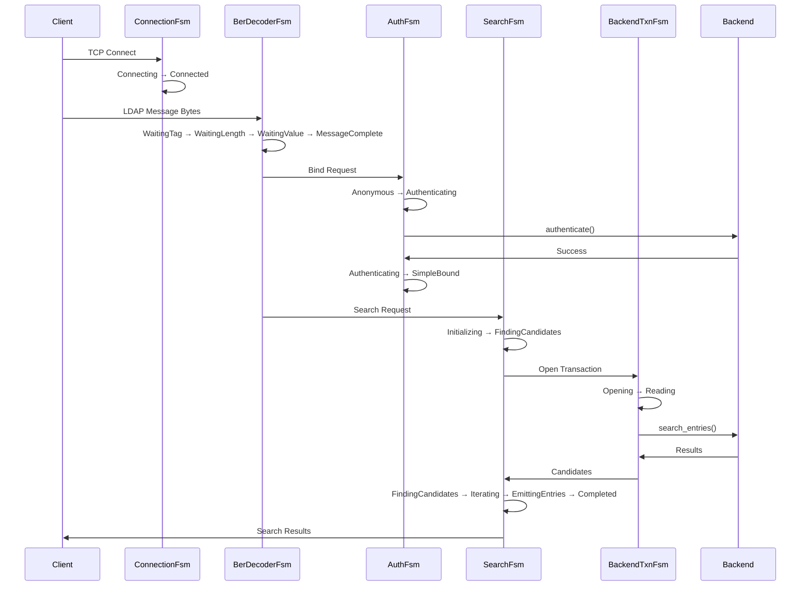

# LDAP Server FSM Architecture - Class Diagram

This document shows the complete class diagram for the opendr LDAP server's finite state machine architecture, illustrating how all components are connected and interact.

## Complete System Architecture

```mermaid
classDiagram
    %% Base FSM Traits
    class StateMachine {
        <<trait>>
        +State: Debug + Clone + PartialEq
        +Event: Debug
        +Error: Error + Send + Sync
        +Output
        +current_state() Self::State
        +handle_event(event) Result~Option~Self::Output~~
        +is_terminal() bool
        +reset() Result~()~
    }

    class AbandonableFsm {
        <<trait>>
        +abandon() Result~()~
        +is_abandoned() bool
    }

    class TimeoutFsm {
        <<trait>>
        +timeout() Option~Duration~
        +start_time() Instant
        +is_timed_out() bool
    }

    %% Transport Layer FSMs
    class ConnectionFsm {
        <<trait>>
        +Stream: AsyncRead + AsyncWrite + Unpin + Send
        +stream() Option~&Self::Stream~
        +stream_mut() Option~&mut Self::Stream~
        +is_secure() bool
        +connection_info() ConnectionInfo
    }

    class BerDecoderFsm {
        <<trait>>
        +buffer() &[u8]
        +bytes_needed() Option~usize~
        +extract_message() Option~Vec~u8~~
        +progress() BerDecodingProgress
    }

    %% Authentication FSMs
    class AuthFsm {
        <<trait>>
        +authenticated_dn() Option~&str~
        +is_authenticated() bool
        +auth_level() AuthLevel
    }

    class SaslFsm {
        <<trait>>
        +mechanism() Option~&str~
        +step() u32
        +authenticated_identity() Option~&str~
        +needs_more_steps() bool
    }

    %% Operation FSMs
    class SearchFsm {
        <<trait>>
        +search_params() Option~&SearchParams~
        +entries_sent() usize
        +size_limit() u32
        +would_exceed_size_limit() bool
    }

    class WriteFsm {
        <<trait>>
        +operation() Option~&WriteOperation~
        +transaction_id() Option~&str~
        +can_rollback() bool
    }

    class CompareFsm {
        <<trait>>
        +compare_params() Option~&CompareParams~
        +result() Option~bool~
    }

    class ExtendedOpFsm {
        <<trait>>
        +operation_oid() Option~&str~
        +operation_value() Option~&[u8]~
        +response_value() Option~&[u8]~
        +requires_delegation() bool
    }

    %% Distribution FSMs
    class ReferralFsm {
        <<trait>>
        +hop_count() u32
        +hop_limit() u32
        +target_urls() &[String]
        +can_hop() bool
    }

    class ReplicationProviderFsm {
        <<trait>>
        +consumer_id() Option~&str~
        +cookie() Option~&str~
        +entries_sent() usize
        +is_streaming() bool
    }

    class ReplicationConsumerFsm {
        <<trait>>
        +provider_url() Option~&str~
        +current_cookie() Option~&str~
        +entries_applied() usize
        +is_listening() bool
    }

    %% Storage FSM
    class BackendTxnFsm {
        <<trait>>
        +transaction_id() Option~&str~
        +reads_performed() usize
        +writes_performed() usize
        +can_commit() bool
        +can_rollback() bool
        +nesting_level() u32
    }

    %% State Enums
    class ConnectionState {
        <<enumeration>>
        Connecting
        Connected
        StartTlsNegotiation
        Secure
        Closing
        Closed
        Error
    }

    class BerDecoderState {
        <<enumeration>>
        WaitingTag
        WaitingLength
        WaitingValue
        MessageComplete
        Error
    }

    class AuthState {
        <<enumeration>>
        Anonymous
        Authenticating
        SimpleBound
        AuthenticationFailed
    }

    class SaslState {
        <<enumeration>>
        Initial
        Challenge
        Response
        Authenticated
        Failed
    }

    class SearchState {
        <<enumeration>>
        Initializing
        FindingCandidates
        Iterating
        EmittingEntries
        Completed
        Abandoned
        TimeLimitExceeded
        SizeLimitExceeded
    }

    class WriteState {
        <<enumeration>>
        Validating
        CheckingSchema
        CheckingAci
        InTransaction
        Committing
        Rollback
        Completed
        Failed
    }

    %% Runtime Management
    class ConnectionFsmSet {
        +connection: DynConnectionFsm
        +decoder: DynBerDecoderFsm
        +auth: AuthenticationFsm
        +operations: Vec~OperationFsm~
        +replication: Option~ReplicationFsm~
    }

    class AuthenticationFsm {
        <<union>>
        Simple(DynAuthFsm)
        Sasl(DynSaslFsm)
    }

    class OperationFsm {
        <<union>>
        Search(DynSearchFsm)
        Write(DynWriteFsm)
        Compare(DynCompareFsm)
        Extended(DynExtendedOpFsm)
        Referral(DynReferralFsm)
        BackendTxn(DynBackendTxnFsm)
    }

    class ReplicationFsm {
        <<union>>
        Provider(DynReplicationProviderFsm)
        Consumer(DynReplicationConsumerFsm)
    }

    %% Support Structures
    class ConnectionInfo {
        +remote_addr: String
        +local_addr: String
        +is_secure: bool
        +protocol_version: String
    }

    class BerDecodingProgress {
        +tag: Option~u8~
        +length: Option~usize~
        +bytes_received: usize
        +bytes_needed: Option~usize~
    }

    class SearchParams {
        +base_dn: String
        +scope: i32
        +filter: String
        +attributes: Vec~String~
        +size_limit: u32
        +time_limit: u32
    }

    class WriteOperation {
        <<enumeration>>
        Add
        Modify
        ModifyDn
        Delete
    }

    %% Existing Backend System
    class DirectoryBackend {
        <<trait>>
        +authenticate(dn, password) Result~bool~
        +get_entry(dn) Result~Option~DirectoryEntry~~
        +add_entry(entry, password) Result~()~
        +delete_entry(dn) Result~()~
        +modify_entry(dn, modifications) Result~()~
        +compare_attribute(dn, attribute, value) Result~bool~
        +rename_entry(dn, new_rdn, delete_old, new_superior) Result~()~
        +search_entries(base_dn, scope) Result~Vec~DirectoryEntry~~
    }

    class MockBackend {
        -entries: RwLock~HashMap~String, StoredEntry~~
        +new() Self
        +from_credentials(credentials) Self
    }

    class FileBackend {
        -storage_path: PathBuf
        -entries: RwLock~HashMap~String, StoredEntry~~
        +new(data_dir) Result~Self~
    }

    class DirectoryEntry {
        +dn: String
        +attributes: HashMap~String, Vec~String~~
        +new(dn, attributes) Self
    }

    %% Trait Inheritance Relationships
    StateMachine <|-- AbandonableFsm
    StateMachine <|-- TimeoutFsm
    StateMachine <|-- ConnectionFsm
    StateMachine <|-- BerDecoderFsm
    StateMachine <|-- AuthFsm
    StateMachine <|-- SaslFsm
    StateMachine <|-- SearchFsm
    StateMachine <|-- WriteFsm
    StateMachine <|-- CompareFsm
    StateMachine <|-- ExtendedOpFsm
    StateMachine <|-- ReferralFsm
    StateMachine <|-- ReplicationProviderFsm
    StateMachine <|-- ReplicationConsumerFsm
    StateMachine <|-- BackendTxnFsm

    %% Special Trait Combinations
    AbandonableFsm <|-- SearchFsm
    TimeoutFsm <|-- SearchFsm

    %% State Associations
    ConnectionFsm --> ConnectionState : uses
    BerDecoderFsm --> BerDecoderState : uses
    AuthFsm --> AuthState : uses
    SaslFsm --> SaslState : uses
    SearchFsm --> SearchState : uses
    WriteFsm --> WriteState : uses

    %% Runtime Composition
    ConnectionFsmSet --> ConnectionFsm : contains
    ConnectionFsmSet --> BerDecoderFsm : contains
    ConnectionFsmSet --> AuthenticationFsm : contains
    ConnectionFsmSet --> OperationFsm : contains 0..*
    ConnectionFsmSet --> ReplicationFsm : contains 0..2

    AuthenticationFsm --> AuthFsm : contains
    AuthenticationFsm --> SaslFsm : contains

    OperationFsm --> SearchFsm : contains
    OperationFsm --> WriteFsm : contains
    OperationFsm --> CompareFsm : contains
    OperationFsm --> ExtendedOpFsm : contains
    OperationFsm --> ReferralFsm : contains
    OperationFsm --> BackendTxnFsm : contains

    ReplicationFsm --> ReplicationProviderFsm : contains
    ReplicationFsm --> ReplicationConsumerFsm : contains

    %% Support Structure Relationships
    ConnectionFsm --> ConnectionInfo : produces
    BerDecoderFsm --> BerDecodingProgress : produces
    SearchFsm --> SearchParams : uses
    WriteFsm --> WriteOperation : uses

    %% Backend Integration
    DirectoryBackend <|.. MockBackend : implements
    DirectoryBackend <|.. FileBackend : implements
    DirectoryBackend --> DirectoryEntry : manages
    WriteFsm --> DirectoryBackend : uses
    SearchFsm --> DirectoryBackend : uses
    CompareFsm --> DirectoryBackend : uses
    BackendTxnFsm --> DirectoryBackend : uses

    %% Type Aliases (shown as notes)
    note for ConnectionFsmSet "Type aliases:\nDynConnectionFsm = Box<dyn ConnectionFsm<...>>\nDynBerDecoderFsm = Box<dyn BerDecoderFsm<...>>\n... etc for all FSM traits"
```

## FSM Interaction Flow

## Key Architectural Patterns

### 1. **Layered FSM Architecture**
- **Transport Layer**: Connection and message decoding
- **Authentication Layer**: Simple/SASL bind handling  
- **Operation Layer**: LDAP operations (parallel execution)
- **Storage Layer**: Transaction and backend interaction

### 2. **Concurrent Operation Model**
- Each LDAP operation gets its own FSM instance
- Multiple operations can run in parallel per connection
- Shared connection and auth state across operations

### 3. **Compositional Design**
- `ConnectionFsmSet` composes all FSMs for a connection
- Union types (`AuthenticationFsm`, `OperationFsm`) provide type-safe variants
- Dynamic dispatch through trait objects with type aliases

### 4. **State Transition Safety**
- All state transitions are explicit through events
- Terminal states prevent further transitions
- Timeout and abandonment support for long-running operations

### 5. **Backend Integration**
- FSMs interact with existing `DirectoryBackend` trait
- Transaction FSMs manage backend state consistency
- Clean separation between protocol logic and storage logic

This architecture provides a robust foundation for implementing a production-quality LDAP server with proper concurrency, state management, and extensibility.