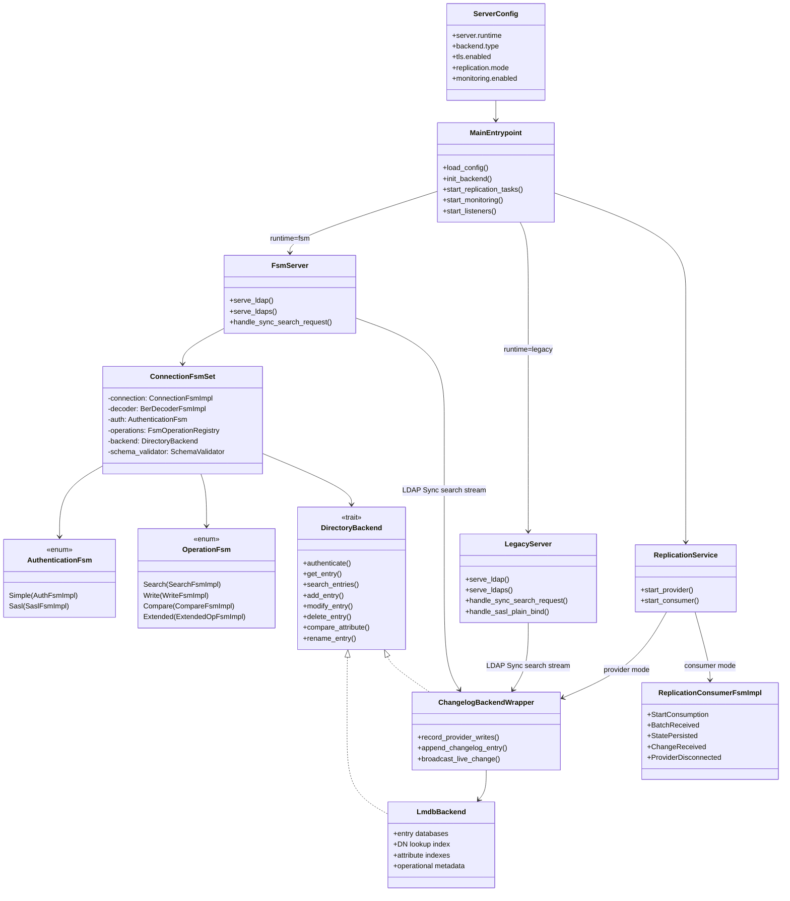

# OpenDR Runtime Composition Diagram

This diagram reflects the current shipped runtime shape. The `opendr` binary
selects either the FSM listener or the legacy listener. The FSM listener owns
connection-local transport, BER decoding, authentication, and operation FSMs.
Replication is not stored inside `ConnectionFsmSet`; provider streaming is served
as LDAP Sync search traffic, while the consumer runs as a replication service
task.

