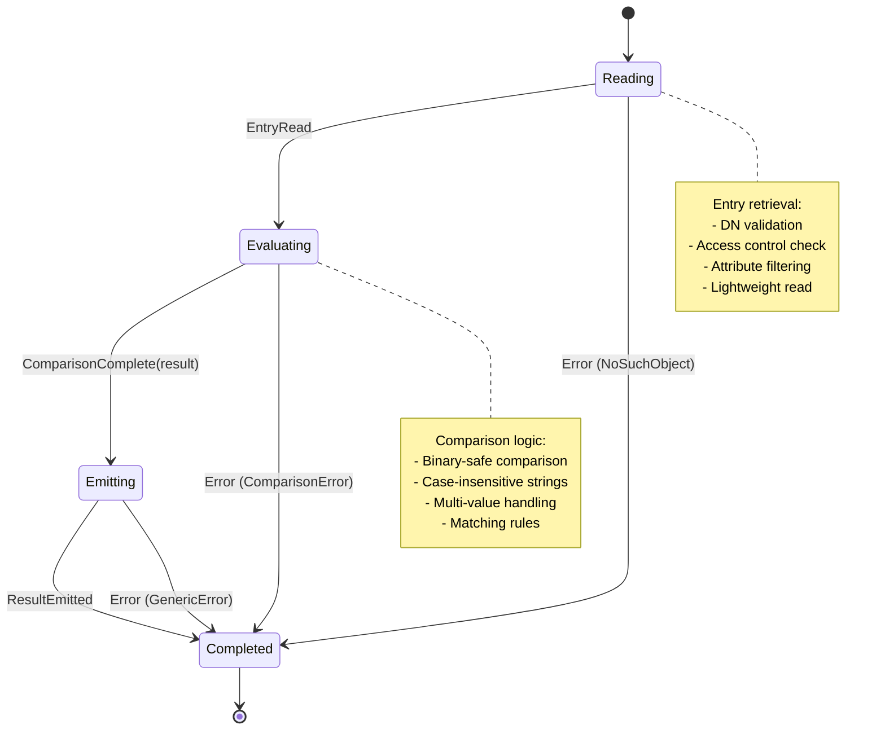
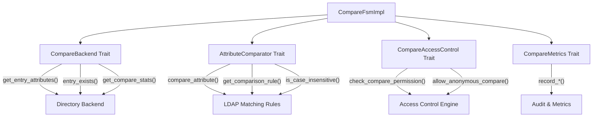

# Compare FSM Documentation

## Overview

The Compare Finite State Machine (`CompareFsmImpl`) manages comprehensive LDAP compare operations. The FSM provides a complete lifecycle for reading directory entries, evaluating attribute comparisons, and emitting boolean results with proper LDAP response codes.

## Architecture

### State Diagram



### Component Architecture



## Key Components

### 1. Compare FSM Implementation (`CompareFsmImpl`)

The main FSM implementation manages:
- **Parameter validation**: DN, attribute name, and value validation
- **Access control checking**: User permission evaluation for compare operations
- **Entry retrieval**: Lightweight entry reading with attribute filtering
- **Attribute comparison**: Binary-safe and case-insensitive comparisons
- **Result emission**: Proper LDAP response code generation
- **Performance monitoring**: Complete operation tracking and metrics

### 2. External Dependencies (Trait Abstractions)

#### CompareBackend Trait
```rust
#[async_trait]
pub trait CompareBackend: Send + Sync {
    async fn get_entry_attributes(&self, dn: &str, attributes: &[String]) -> Result<Option<CompareEntry>, String>;
    async fn entry_exists(&self, dn: &str) -> Result<bool, String>;
    async fn get_compare_stats(&self, dn: &str) -> Result<(u64, u64), String>;
}
```

#### AttributeComparator Trait
```rust
#[async_trait]
pub trait AttributeComparator: Send + Sync {
    async fn compare_attribute(&self, entry: &CompareEntry, attr_name: &str, value: &[u8]) -> Result<bool, String>;
    fn get_comparison_rule(&self, attr_name: &str) -> String;
    fn is_case_insensitive(&self, attr_name: &str) -> bool;
}
```

#### CompareAccessControl Trait
```rust
#[async_trait]
pub trait CompareAccessControl: Send + Sync {
    async fn check_compare_permission(&self, user_dn: Option<&str>, entry_dn: &str, attribute: &str) -> Result<(), String>;
    fn policy_version(&self) -> String;
    fn allow_anonymous_compare(&self) -> bool;
}
```

#### CompareMetrics Trait
```rust
pub trait CompareMetrics: Send + Sync {
    fn record_compare_start(&self, params: &CompareParams, user_dn: Option<&str>);
    fn record_entry_read(&self, dn: &str, found: bool, duration: Duration);
    fn record_comparison_complete(&self, attribute: &str, result: bool, duration: Duration);
    fn record_compare_complete(&self, result: bool, duration: Duration);
    fn record_compare_error(&self, error_type: &str, duration: Duration);
    fn get_stats(&self) -> (u64, u64, f64);
}
```

### 3. Data Structures

#### CompareEntry
Represents an LDAP entry for compare operations:
```rust
pub struct CompareEntry {
    pub dn: String,
    pub attributes: HashMap<String, Vec<Vec<u8>>>,
    pub object_classes: Vec<String>,
}
```

#### CompareParams  
Compare operation parameters:
```rust
pub struct CompareParams {
    pub dn: String,
    pub attribute: String,
    pub value: Vec<u8>,
}
```

#### CompareSession
Tracks active compare operation state:
```rust
pub struct CompareSession {
    pub params: CompareParams,
    pub user_dn: Option<String>,
    pub start_time: Instant,
    pub entry: Option<CompareEntry>,
    pub result: Option<bool>,
    pub entry_read_time: Option<Instant>,
    pub comparison_complete_time: Option<Instant>,
}
```

#### CompareFsmConfig
Configuration for FSM behavior:
```rust
pub struct CompareFsmConfig {
    pub max_backend_timeout: u32,
    pub max_value_size: usize,
    pub enable_access_control: bool,
    pub enable_metrics: bool,
    pub allow_operational_attributes: bool,
}
```

## Compare Operation Flow

### 1. Parameter Validation
1. **DN Validation**: Non-empty distinguished name
2. **Attribute Validation**: Non-empty attribute name  
3. **Value Size Check**: Maximum value size enforcement
4. **Operational Attributes**: Optional restriction of operational attributes
5. **Access Control**: User permission verification for compare operation

### 2. Entry Reading
1. **Lightweight Retrieval**: Fetch only the requested attribute
2. **Existence Check**: Verify entry exists in directory
3. **Attribute Filtering**: Return only the attribute being compared
4. **Performance Tracking**: Record read duration and success rate

### 3. Attribute Comparison
1. **Comparison Rules**: Apply appropriate LDAP matching rules
2. **Case Sensitivity**: Handle case-insensitive string attributes
3. **Multi-value Support**: Return true if any value matches
4. **Binary Safety**: Support for binary attribute values
5. **Error Handling**: Proper error responses for comparison failures

### 4. Result Emission
1. **Boolean Result**: Generate true/false comparison result
2. **LDAP Response**: Emit proper LDAP compare response codes
3. **Metrics Recording**: Track operation completion and performance
4. **Statistics Update**: Update FSM-level success/failure counters

## LDAP Compare Operation

### Standard Behavior
The LDAP Compare operation tests whether a particular attribute-value assertion exists in a specific entry. Key characteristics:

- **Privacy Preserving**: Returns only boolean result, not actual values
- **Standard Operation**: Defined in RFC 4511 section 4.10
- **Multi-value Handling**: Returns true if ANY value matches
- **Access Control**: Subject to directory access control policies
- **Atomic Operation**: Either succeeds completely or fails

### Supported Attribute Types
The FSM supports comparison of:
- **String Attributes**: Case-insensitive comparison for common string attributes
- **Binary Attributes**: Exact binary matching for certificates, photos, etc.
- **Numeric Attributes**: Exact numeric value matching
- **DN Attributes**: Distinguished name comparison with proper DN parsing
- **Operational Attributes**: Optional support for operational attributes

### Common Use Cases
1. **Password Verification**: Compare user-provided password with stored hash
2. **Group Membership**: Check if user DN is in group member attribute
3. **Certificate Validation**: Compare client certificate with stored certificate
4. **Attribute Existence**: Verify specific attribute values exist
5. **Policy Enforcement**: Check attribute values against policy rules

## Configuration Options

### Backend Timeouts
```rust
CompareFsmConfig {
    max_backend_timeout: 30,  // Maximum wait for backend (seconds)
    max_value_size: 1_048_576, // Maximum attribute value size (1MB)
    enable_access_control: true, // Enable permission checking
    enable_metrics: true, // Enable performance tracking
    allow_operational_attributes: false, // Restrict operational attributes
}
```

### Access Control Integration
The FSM integrates with directory access control:
- **User Authentication**: Checks authenticated user identity
- **Permission Evaluation**: Verifies compare permission for specific attributes
- **Anonymous Access**: Configurable anonymous compare support
- **Attribute-level Control**: Granular permission checking per attribute

### Performance Optimization
- **Lightweight Reads**: Retrieves only the required attribute
- **Connection Pooling**: Reuses backend connections
- **Result Caching**: Optional caching of comparison results
- **Statistics Collection**: Performance monitoring and optimization hints

## Usage Patterns

### Basic Compare Operation
```rust
let backend = Box::new(MyCompareBackend::new());
let comparator = Box::new(MyAttributeComparator::new());
let access_control = Box::new(MyCompareAccessControl::new());

let mut fsm = CompareFsmImpl::new(backend, comparator, access_control);

// Start compare operation
let result = fsm.handle_event(CompareEvent::StartCompare {
    dn: "cn=john,ou=people,dc=example,dc=org".to_string(),
    attribute: "userPassword".to_string(),
    value: b"secret123".to_vec(),
}).await?;

// Process through FSM states
fsm.handle_event(CompareEvent::EntryRead).await?;
fsm.handle_event(CompareEvent::ComparisonComplete(true)).await?;
fsm.handle_event(CompareEvent::ResultEmitted).await?;

// Check result
assert_eq!(fsm.result(), Some(true));
```

### Compare with Custom Configuration
```rust
let config = CompareFsmConfig {
    max_backend_timeout: 60,
    max_value_size: 2_097_152, // 2MB
    enable_access_control: false,
    enable_metrics: true,
    allow_operational_attributes: true,
};

let fsm = CompareFsmImpl::with_config(backend, comparator, access_control, config);
```

### Compare with Metrics
```rust
let metrics = Box::new(MyCompareMetrics::new());
let fsm = CompareFsmImpl::new(backend, comparator, access_control)
    .with_metrics(metrics);

// Metrics will automatically track:
// - Operation start/completion times  
// - Entry read success/failure rates
// - Comparison result statistics
// - Error types and frequencies
```

### Multi-value Attribute Comparison
```rust
// For multi-value attributes, comparison returns true if ANY value matches
let member_values = vec![
    b"cn=john,ou=people,dc=example,dc=org".to_vec(),
    b"cn=jane,ou=people,dc=example,dc=org".to_vec(),
    b"cn=bob,ou=people,dc=example,dc=org".to_vec(),
];

// This would return true if comparing against any of the member values
let result = fsm.handle_event(CompareEvent::StartCompare {
    dn: "cn=developers,ou=groups,dc=example,dc=org".to_string(),
    attribute: "member".to_string(),
    value: b"cn=john,ou=people,dc=example,dc=org".to_vec(),
}).await?;
```

## Error Handling

### Error Types
The FSM defines comprehensive error types:

```rust
pub enum CompareFsmError {
    InvalidParameters { message: String },
    BackendError { message: String },
    ComparisonError { message: String },
    AccessDenied { message: String },
    NoSuchObject { dn: String },
    NoSuchAttribute { dn: String, attribute: String },
    InvalidStateTransition { from: CompareState, to: CompareState },
    NoActiveCompare,
    Generic { message: String },
}
```

### Error Recovery
- **Parameter Errors**: Caught during validation with descriptive messages
- **Backend Errors**: Handled with appropriate LDAP response codes
- **Access Denied**: Proper access control enforcement
- **Missing Objects**: Clear indication of non-existent entries or attributes
- **Comparison Failures**: Graceful handling of comparison rule failures

## Performance Considerations

### Optimization Strategies
1. **Minimal Data Transfer**: Retrieve only the required attribute
2. **Connection Reuse**: Efficient backend connection pooling
3. **Caching Support**: Optional result caching for repeated comparisons
4. **Parallel Processing**: Support for concurrent compare operations
5. **Metrics-driven Optimization**: Performance monitoring for tuning

### Scalability Features
- **Configurable Timeouts**: Prevent long-running operations
- **Value Size Limits**: Control memory usage for large attributes
- **Access Control Integration**: Efficient permission checking
- **Metrics Collection**: Performance tracking and optimization hints
- **Backend Abstraction**: Support for different storage implementations

## Testing

The Compare FSM includes comprehensive tests:

### Unit Tests
- **State Transitions**: All valid compare operation flows
- **Event Handling**: All compare events and error conditions
- **Parameter Validation**: Input validation and error cases
- **Access Control**: Permission checking and denial scenarios
- **Backend Integration**: Mock backend interaction testing
- **Trait Implementations**: All FSM trait implementations

### Mock Implementations
Complete mock implementations for testing:
- `MockCompareBackend`: Configurable backend simulation
- `MockAttributeComparator`: Comparison logic simulation  
- `MockCompareAccessControl`: Access control simulation
- `MockCompareMetrics`: Metrics collection simulation

### Test Coverage
- **Happy Path**: Successful compare operations for various attribute types
- **Error Conditions**: All error types and recovery scenarios
- **Edge Cases**: Empty attributes, missing entries, access denial
- **Performance**: Timeout handling and resource limits
- **Configuration**: All configuration options and their effects

## Integration Points

### LDAP Server Integration
The Compare FSM integrates with the LDAP server through:
1. **Message Parsing**: Processes incoming LDAP compare requests
2. **Backend Coordination**: Interfaces with directory storage systems
3. **Response Generation**: Creates appropriate LDAP response messages
4. **Access Control**: Integrates with server authentication and authorization

### Backend Integration
The FSM works with various backend implementations:
- **Mock Backend**: For development and testing
- **Memory Backend**: For simple in-memory storage
- **Database Backend**: For persistent storage with SQL databases
- **LDAP Backend**: For proxying to other LDAP servers
- **Custom Backends**: Extensible architecture for specialized storage

## Future Enhancements

### Planned Features
1. **Result Caching**: Cache comparison results for performance
2. **Batch Compare**: Multiple comparison operations in single request  
3. **Extended Matching**: Support for more LDAP matching rules
4. **Schema Integration**: Schema-aware comparison rule selection
5. **Replication Support**: Compare operation logging for replication

### Extension Points
- **Custom Comparators**: Plugin architecture for specialized comparison logic
- **Backend Plugins**: Support for additional storage systems
- **Access Control Plugins**: Flexible authorization policy implementations  
- **Metrics Plugins**: Custom metrics collection and reporting systems

---

**See Also:**
- [FSM Architecture Overview](./architecture-overview.md)
- [Search FSM Documentation](./search_fsm.md)  
- [Write FSM Documentation](./write_fsm.md)
- [Auth FSM Documentation](./auth_fsm.md)
- [Connection FSM Documentation](./connection_fsm.md)