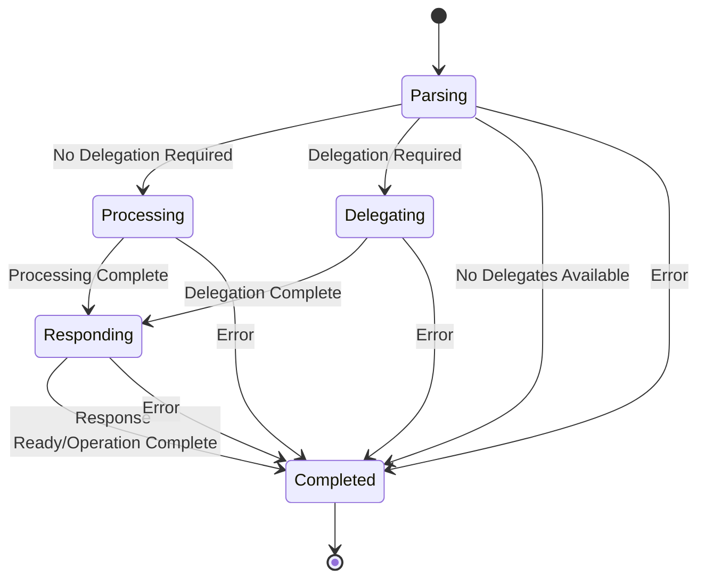

# Extended Operation FSM Architecture

## Overview

The Extended Operation FSM (`ExtendedOpFsm`) is a comprehensive finite state machine that manages LDAP extended operations in the opendr LDAP server. It handles complex extended operations such as StartTLS, Password Modify, WhoAmI, and custom operations through a sophisticated delegation and processing system.

## Architecture

### State Machine Design

The Extended-Op FSM follows a clear state progression:



### States

- **Parsing**: Initial state where operation OID and parameters are validated
- **Processing**: Direct backend execution of the extended operation
- **Delegating**: Delegation to external handlers (e.g., TLS negotiation)
- **Responding**: Preparing and sending response data
- **Completed**: Terminal state with operation result

### Events

- `StartExtendedOp`: Initiates an extended operation with OID and optional value
- `ParseComplete`: Signals successful parsing and validation
- `ProcessingComplete`: Backend processing has finished
- `DelegationComplete`: External delegation has completed
- `ResponseReady`: Response data is ready for transmission
- `OperationComplete`: Final completion event
- `Error`: Error occurred (can happen from any state)

## Components

### Core Traits

#### ExtendedOpFsm
The main FSM trait providing:
- `operation_oid()`: Get the operation OID being processed
- `operation_value()`: Get the raw operation value
- `response_value()`: Get the response data when ready
- `requires_delegation()`: Check if operation needs delegation

#### ExtendedOpBackend
Handles actual operation execution:
- `execute_operation()`: Execute the operation and return response data
- `is_operation_supported()`: Check if an OID is supported
- `requires_delegation()`: Determine if operation needs delegation

#### ExtendedOpParser
Parses and validates operation requests:
- `parse_request()`: Parse OID and value into structured operation
- `validate_operation()`: Validate parsed operation parameters

#### ExtendedOpDelegator
Manages delegation to external systems:
- `delegate_operation()`: Delegate operation to external handler
- `get_delegates()`: Get available delegates for an OID

#### ExtendedOpAccessControl
Handles permission checking:
- `check_permission()`: Verify user can perform the operation

#### ExtendedOpMetrics
Collects operational metrics:
- `record_operation_start()`: Log operation initiation
- `record_operation_complete()`: Log completion with timing
- `record_delegation()`: Log delegation events

### Data Structures

#### ParsedOperation
Structured representation of an extended operation:
- `oid`: Operation identifier
- `operation_type`: Enumerated operation type
- `parameters`: Key-value parameter map
- `requires_delegation`: Whether delegation is needed

#### ExtendedOperationType
Supported operation types:
- `StartTLS`: TLS upgrade operation
- `PasswordModify`: Password change operation
- `WhoAmI`: Identity query operation
- `Cancel`: Operation cancellation
- `ModifyPassword`: Alternative password modification
- `Custom(String)`: User-defined operations

#### ExtendedOpError
Custom error type with:
- Display implementation for user-friendly messages
- `contains()` method for substring matching
- Conversion from String and &str

## Operation Flow

### Standard Processing Flow

1. **Initialization**: FSM starts in `Parsing` state
2. **Operation Start**: `StartExtendedOp` event received with OID and value
3. **Access Control**: Check user permissions for the operation
4. **Parsing**: Parse and validate the operation request
5. **Backend Check**: Verify operation is supported
6. **Routing Decision**:
   - If delegation required → transition to `Delegating`
   - If direct processing → transition to `Processing`
7. **Execution**: Either delegate or process directly
8. **Response**: Prepare response data in `Responding` state
9. **Completion**: Finalize in `Completed` state with result code

### Delegation Flow

For operations requiring delegation (e.g., StartTLS):

1. Operation parsed and identified as requiring delegation
2. Available delegates queried from delegator
3. If delegates available → delegate operation
4. External system handles the operation
5. Response returned and forwarded to client

### Error Handling

Errors can occur at any stage and will:
- Transition FSM to `Completed` state with error result code
- Record metrics for failure tracking
- Provide detailed error information through `ExtendedOpError`

## Implementation Details

### Trait Abstractions

The FSM uses trait abstractions to separate concerns:

- **Backend abstraction** allows different operation executors
- **Parser abstraction** enables custom operation formats
- **Delegator abstraction** supports pluggable external handlers
- **Access control abstraction** allows different permission systems
- **Metrics abstraction** enables various monitoring systems

### Error Management

Custom error type `ExtendedOpError`:
- Implements `std::error::Error` for proper error handling
- Provides substring matching for testing
- Converts seamlessly from string types

### Testing Strategy

Comprehensive test coverage includes:
- Unit tests for each public method
- State transition validation
- Error scenario coverage
- Mock implementations for all dependencies
- Integration tests for complete operation flows

## Usage Examples

### Basic Extended Operation

```rust
use opendr::extended_op_fsm::{ExtendedOpFsmImpl, /* trait implementations */};
use opendr::fsm::{StateMachine, ExtendedOpEvent};

// Create FSM with implementations
let mut fsm = ExtendedOpFsmImpl::new(
    backend,
    parser,
    delegator,
    access_control,
    metrics,
);

// Set user context
fsm.set_user_dn("cn=user,dc=example,dc=org".to_string());

// Start operation
let event = ExtendedOpEvent::StartExtendedOp {
    oid: "1.3.6.1.4.1.4203.1.11.3".to_string(), // WhoAmI
    value: None,
};

let result = fsm.handle_event(event).await?;
```

### Custom Operation Implementation

```rust
// Custom backend for specific operations
struct CustomExtendedOpBackend;

#[async_trait]
impl ExtendedOpBackend for CustomExtendedOpBackend {
    async fn execute_operation(&self, oid: &str, value: Option<&[u8]>) -> Result<Vec<u8>, String> {
        match oid {
            "1.2.3.4.5.custom" => {
                // Custom operation logic
                Ok(b"Custom response".to_vec())
            },
            _ => Err("Unsupported operation".to_string())
        }
    }
    
    fn is_operation_supported(&self, oid: &str) -> bool {
        oid == "1.2.3.4.5.custom"
    }
    
    fn requires_delegation(&self, _oid: &str) -> bool {
        false
    }
}
```

## Integration with LDAP Server

The Extended-Op FSM integrates seamlessly with the opendr LDAP server:

1. **Message Processing**: Server receives extended operation requests
2. **FSM Creation**: New FSM instance created for each operation
3. **Context Setup**: User DN and other context set on FSM
4. **Event Processing**: Operation events fed to FSM
5. **Response Handling**: FSM response data encoded and sent to client

## Performance Considerations

- **Async Processing**: All operations are fully asynchronous
- **Resource Management**: FSM lifecycle tied to operation lifecycle
- **Metrics Collection**: Minimal overhead timing and counting
- **Error Propagation**: Efficient error handling without allocations
- **Memory Usage**: Bounded memory usage per operation

## Security Features

- **Access Control**: Fine-grained permission checking per operation
- **Input Validation**: Comprehensive validation of all operation parameters
- **Error Sanitization**: Safe error messages without information leakage
- **Delegation Safety**: Secure handoff to external systems
- **Audit Trail**: Complete metrics and logging for security analysis

## Future Extensions

The Extended-Op FSM is designed for extensibility:

- **New Operations**: Easy addition of custom extended operations
- **Enhanced Delegation**: Support for more complex delegation patterns
- **Advanced Metrics**: Rich telemetry and monitoring capabilities
- **Policy Integration**: Fine-grained policy enforcement
- **Caching**: Response caching for frequently-used operations