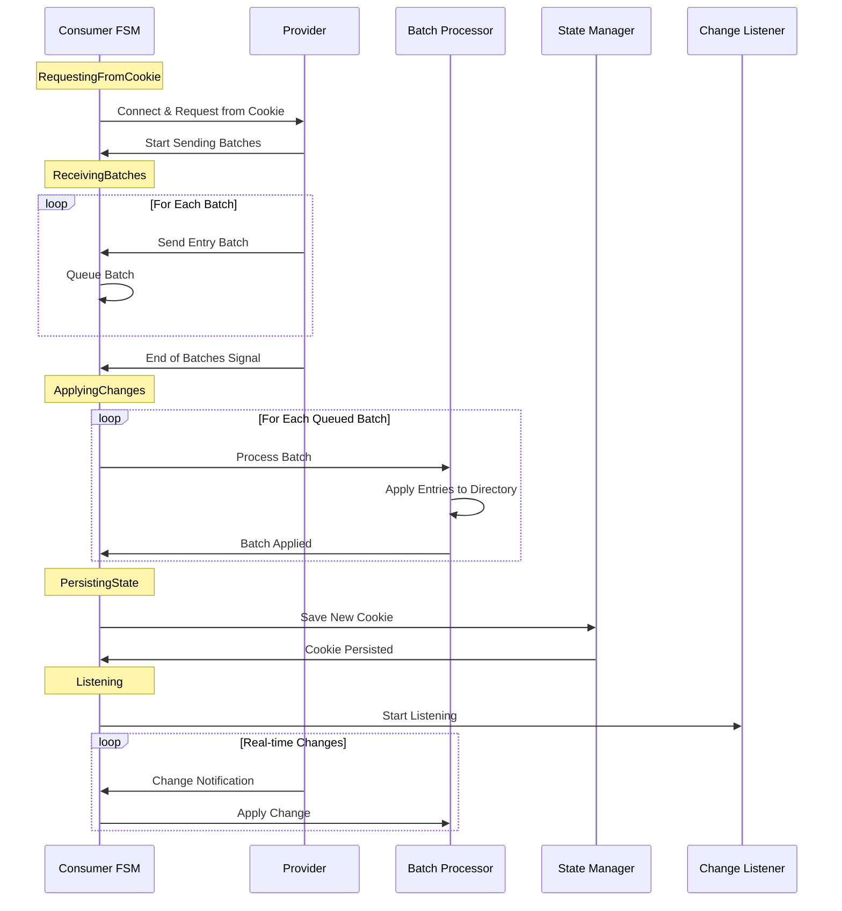
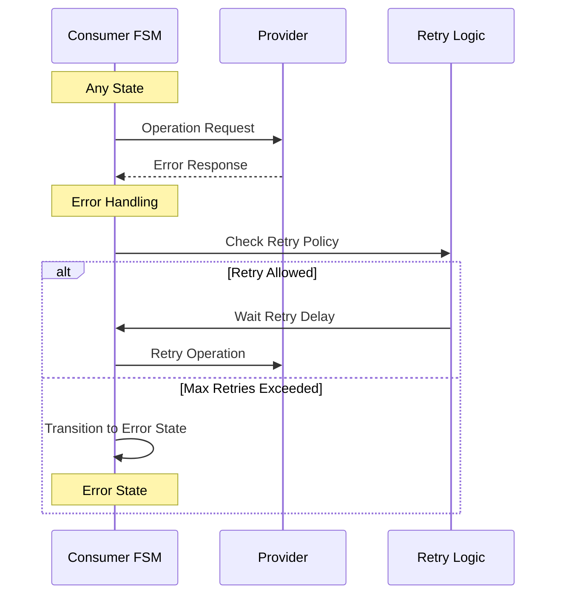

# Replication Consumer FSM Architecture

This document provides comprehensive documentation for the LDAP Content Synchronization Consumer Finite State Machine implementation, following RFC 4533 specifications.

## Overview

The Replication Consumer FSM implements the consumer side of LDAP Content Synchronization as defined in RFC 4533. It manages the complete lifecycle of replication consumption: requesting data from a provider, applying batches of entries, persisting state, and listening for real-time changes.

### Purpose

The Consumer FSM serves as the cornerstone for building robust LDAP directory replication consumers that can:

- **Synchronize** with replication providers using cookies for state management
- **Process** large batches of directory entries efficiently
- **Persist** replication state for fault tolerance and resumption
- **Listen** for real-time changes after initial synchronization
- **Handle** various error conditions gracefully with retry logic

### Role in LDAP Replication

The Consumer FSM works in tandem with a Replication Provider to maintain directory consistency across distributed LDAP deployments. It implements the consumer-specific parts of the sync replication protocol, handling the complexities of state management, batch processing, and real-time updates.

## Architecture Overview

### State Machine Pattern

The FSM follows a linear progression through well-defined states:

```text
┌─────────────────────┐    ┌──────────────────┐    ┌─────────────────┐
│ RequestingFromCookie│───▶│ ReceivingBatches │───▶│ ApplyingChanges │
└─────────────────────┘    └──────────────────┘    └─────────────────┘
                                     │                        │
                                     ▼                        ▼
┌─────────────┐    ┌────────────────┐    ┌──────────────────┐
│  Listening  │◀───│ PersistingState│◀───│    (completed)   │
└─────────────┘    └────────────────┘    └──────────────────┘
      │                     │
      ▼                     ▼
┌─────────────┐    ┌─────────────────┐
│  Completed  │    │     Error       │
└─────────────┘    └─────────────────┘
```

### Core Components

1. **State Management**: Tracks current FSM state and handles transitions
2. **Event Processing**: Processes events and triggers appropriate state transitions
3. **External Dependencies**: Interfaces with provider connection, batch processing, state persistence, and change listening
4. **Configuration**: Configurable parameters for timeouts, batch sizes, and operational modes
5. **Metrics & Monitoring**: Performance tracking and operational visibility

## State Descriptions

### RequestingFromCookie

**Purpose**: Initial state that establishes connection with the provider and requests replication data.

**Responsibilities**:
- Connect to the replication provider server
- Send synchronization request with optional replication cookie
- Handle authentication and protocol negotiation
- Transition to ReceivingBatches when data starts arriving

**Typical Duration**: Short (seconds) - connection establishment and initial request

**Error Handling**: Connection failures, authentication errors, invalid cookies

### ReceivingBatches

**Purpose**: Accumulates batches of directory entries sent by the provider.

**Responsibilities**:
- Receive and buffer incoming entry batches
- Validate batch integrity and format
- Queue batches for processing
- Transition to ApplyingChanges when ready to process

**Typical Duration**: Variable (minutes to hours) - depends on data volume and network conditions

**Error Handling**: Network interruptions, malformed batches, buffer overflow

### ApplyingChanges

**Purpose**: Processes each entry batch and applies changes to the local directory.

**Responsibilities**:
- Process queued batches in order
- Apply individual entries to local directory
- Handle entry conflicts and validation errors
- Track progress and maintain statistics
- Transition to PersistingState when all batches are processed

**Typical Duration**: Variable (minutes to hours) - depends on entry complexity and local directory performance

**Error Handling**: Entry validation failures, directory write errors, constraint violations

### PersistingState

**Purpose**: Saves the current replication state for future synchronization sessions.

**Responsibilities**:
- Generate new replication cookie reflecting current state
- Persist cookie to reliable storage
- Verify persistence operation success
- Transition to Listening or Completed based on configuration

**Typical Duration**: Short (seconds) - storage I/O operations

**Error Handling**: Storage failures, permission errors, disk space issues

### Listening

**Purpose**: Maintains connection with provider to receive real-time change notifications.

**Responsibilities**:
- Establish persistent change notification channel
- Process incoming change notifications as they arrive
- Apply real-time changes to local directory
- Maintain connection health with heartbeats

**Typical Duration**: Long-running (hours to days) - persistent connection maintenance

**Error Handling**: Connection drops, notification processing errors, change application failures

### Completed

**Purpose**: Terminal state indicating successful completion of replication.

**Responsibilities**:
- Clean up resources and connections
- Generate final statistics and reports
- Log successful completion

**Typical Duration**: Immediate - no ongoing processing

### Error

**Purpose**: Terminal state indicating replication failure requiring intervention.

**Responsibilities**:
- Log error details and context
- Clean up partial state and connections
- Provide diagnostic information for troubleshooting

**Typical Duration**: Immediate - no recovery attempts

## Event Flow

### Complete Synchronization Sequence



### Error Recovery Sequence



## Integration Guide

### Basic Setup

```rust
use opendr::replication_consumer_fsm::{
    ReplicationConsumerFsmImpl, ConsumerConfig,
    ProviderConnection, BatchProcessor, StateManager, ChangeListener
};

// Create dependency implementations
let provider_connection = Box::new(LdapProviderConnection::new());
let batch_processor = Box::new(DirectoryBatchProcessor::new());
let state_manager = Box::new(FilesystemStateManager::new("/var/lib/ldap/replication"));
let change_listener = Box::new(RealtimeChangeListener::new());

// Create FSM with dependencies
let mut consumer = ReplicationConsumerFsmImpl::new(
    provider_connection,
    batch_processor,
    state_manager,
    change_listener
);

// Start replication
consumer.handle_event(ReplicationConsumerEvent::StartConsumption {
    provider_url: "ldap://provider.example.com:389".to_string(),
    cookie: None, // First sync
}).await?;
```

### Custom Configuration

```rust
let config = ConsumerConfig {
    max_batch_size: 500,
    provider_timeout: Duration::from_secs(60),
    max_retry_attempts: 5,
    retry_delay: Duration::from_secs(10),
    enable_change_listening: true,
    heartbeat_interval: Duration::from_secs(30),
    change_buffer_size: 2000,
    state_persistence_timeout: Duration::from_secs(15),
};

let consumer = ReplicationConsumerFsmImpl::with_config(
    provider_connection,
    batch_processor,
    state_manager,
    change_listener,
    config
);
```

### With Metrics

```rust
let metrics = Box::new(PrometheusConsumerMetrics::new());
let consumer = ReplicationConsumerFsmImpl::new(/* dependencies */)
    .with_metrics(metrics);
```

### Implementing External Dependencies

#### Provider Connection

```rust
struct LdapProviderConnection {
    client: Option<LdapClient>,
}

#[async_trait]
impl ProviderConnection for LdapProviderConnection {
    async fn connect(&self, url: &str) -> Result<(), ConsumerError> {
        // Implement LDAP connection logic
        let client = LdapClient::connect(url).await?;
        // Store client for future use
        Ok(())
    }
    
    async fn request_from_cookie(&self, cookie: Option<&str>) -> Result<Vec<Vec<u8>>, ConsumerError> {
        // Implement sync request with cookie
        let sync_request = if let Some(cookie) = cookie {
            SyncRequest::from_cookie(cookie)
        } else {
            SyncRequest::full_sync()
        };
        
        let entries = self.client.sync_search(sync_request).await?;
        Ok(entries)
    }
}
```

#### Batch Processor

```rust
struct DirectoryBatchProcessor {
    directory: Arc<Directory>,
}

#[async_trait]
impl BatchProcessor for DirectoryBatchProcessor {
    async fn process_batch(&self, entries: Vec<Vec<u8>>) -> Result<(), ConsumerError> {
        let mut transaction = self.directory.begin_transaction().await?;
        
        for entry_data in entries {
            let entry = parse_ldap_entry(&entry_data)?;
            transaction.apply_entry(entry).await?;
        }
        
        transaction.commit().await?;
        Ok(())
    }
    
    async fn apply_entry(&self, entry: &[u8]) -> Result<(), ConsumerError> {
        let parsed_entry = parse_ldap_entry(entry)?;
        self.directory.apply_change(parsed_entry).await?;
        Ok(())
    }
}
```

## Configuration Reference

### ConsumerConfig Fields

| Field | Type | Default | Description |
|-------|------|---------|-------------|
| `max_batch_size` | `usize` | 100 | Maximum entries per batch for processing |
| `provider_timeout` | `Duration` | 30s | Timeout for provider operations |
| `max_retry_attempts` | `u32` | 3 | Maximum retry attempts for failed operations |
| `retry_delay` | `Duration` | 5s | Delay between retry attempts |
| `enable_change_listening` | `bool` | true | Enable real-time change listening after sync |
| `heartbeat_interval` | `Duration` | 60s | Interval for provider connection heartbeats |
| `change_buffer_size` | `usize` | 1000 | Buffer size for change notifications |
| `state_persistence_timeout` | `Duration` | 10s | Timeout for state persistence operations |

### Performance Tuning

#### Batch Size Tuning
- **Small batches (10-50 entries)**: Lower memory usage, higher transaction overhead
- **Medium batches (100-500 entries)**: Balanced performance for most scenarios
- **Large batches (1000+ entries)**: Higher throughput, increased memory usage

#### Timeout Configuration
- **provider_timeout**: Should account for network latency and provider response time
- **state_persistence_timeout**: Should match storage system performance characteristics

#### Buffer Sizing
- **change_buffer_size**: Size based on expected change notification rate and processing speed

## Error Handling

### Error Categories

#### Connection Errors
- **Network failures**: TCP connection drops, DNS resolution failures
- **Authentication failures**: Invalid credentials, expired certificates
- **Protocol errors**: Incompatible LDAP versions, unsupported operations

**Recovery Strategy**: Exponential backoff with jitter, credential refresh, protocol negotiation

#### Processing Errors
- **Entry validation failures**: Schema violations, invalid DN formats
- **Constraint violations**: Referential integrity, uniqueness constraints
- **Directory failures**: Disk space, permission errors, corruption

**Recovery Strategy**: Skip invalid entries, log for manual review, integrity checks

#### State Management Errors
- **Storage failures**: Disk failures, permission errors, corruption
- **Cookie corruption**: Invalid format, missing metadata
- **Consistency errors**: State/directory mismatch

**Recovery Strategy**: Fallback storage, cookie regeneration, full resync

### Error Recovery Patterns

#### Automatic Recovery
```rust
// Configure automatic retry with exponential backoff
let config = ConsumerConfig {
    max_retry_attempts: 5,
    retry_delay: Duration::from_secs(1),
    ..Default::default()
};
```

#### Manual Recovery
```rust
// Check FSM state and handle errors
match consumer.current_state() {
    ReplicationConsumerState::Error => {
        // Log error details
        log::error!("Replication failed: {:?}", consumer.get_last_error());
        
        // Reset and retry
        consumer.reset().await?;
        consumer.handle_event(/* restart event */).await?;
    }
    _ => { /* normal processing */ }
}
```

#### Circuit Breaker Pattern
```rust
struct CircuitBreakerConsumer {
    consumer: ReplicationConsumerFsmImpl,
    circuit_breaker: CircuitBreaker,
}

impl CircuitBreakerConsumer {
    async fn replicate(&mut self) -> Result<(), ConsumerError> {
        if self.circuit_breaker.is_open() {
            return Err(ConsumerError::Generic { 
                message: "Circuit breaker open".to_string() 
            });
        }
        
        match self.consumer.handle_event(/* event */).await {
            Ok(result) => {
                self.circuit_breaker.record_success();
                Ok(result)
            }
            Err(error) => {
                self.circuit_breaker.record_failure();
                Err(error)
            }
        }
    }
}
```

## Performance Considerations

### Batching Strategy

#### Optimal Batch Sizes
- **Entry size dependent**: Larger entries require smaller batches
- **Memory constrained**: Monitor heap usage and adjust accordingly  
- **Network optimization**: Balance throughput vs. latency

#### Batch Processing Pipeline
```rust
// Parallel batch processing for improved throughput
async fn process_batches_parallel(
    batches: Vec<Vec<Vec<u8>>>,
    processor: &dyn BatchProcessor,
    concurrency: usize
) -> Result<(), ConsumerError> {
    let semaphore = Arc::new(Semaphore::new(concurrency));
    let mut handles = vec![];
    
    for batch in batches {
        let permit = semaphore.clone().acquire_owned().await.unwrap();
        let processor = processor.clone();
        
        let handle = tokio::spawn(async move {
            let _permit = permit;
            processor.process_batch(batch).await
        });
        
        handles.push(handle);
    }
    
    // Wait for all batches to complete
    for handle in handles {
        handle.await??;
    }
    
    Ok(())
}
```

### Threading Considerations

#### FSM Thread Safety
- FSM instances are **not thread-safe** - use per-thread instances or external synchronization
- External dependencies should be thread-safe for concurrent access
- State persistence must handle concurrent access from multiple consumers

#### Async Processing
- All FSM operations are async-friendly
- Use appropriate async runtimes (Tokio recommended)
- Configure runtime thread pools based on workload characteristics

### Memory Usage

#### Memory Optimization
- **Streaming processing**: Avoid loading entire datasets into memory
- **Batch size tuning**: Balance memory usage vs. processing efficiency
- **Resource cleanup**: Ensure proper cleanup of temporary resources

#### Monitoring Memory Usage
```rust
// Example memory monitoring integration
struct MemoryAwareBatchProcessor {
    processor: Box<dyn BatchProcessor>,
    memory_monitor: MemoryMonitor,
    max_memory_usage: usize,
}

impl MemoryAwareBatchProcessor {
    async fn process_batch(&self, entries: Vec<Vec<u8>>) -> Result<(), ConsumerError> {
        let current_usage = self.memory_monitor.current_usage();
        
        if current_usage > self.max_memory_usage {
            // Apply backpressure or batch splitting
            return Err(ConsumerError::Generic {
                message: "Memory limit exceeded".to_string()
            });
        }
        
        self.processor.process_batch(entries).await
    }
}
```

## Examples

### Basic Replication Consumer

```rust
use opendr::replication_consumer_fsm::*;
use tokio;

#[tokio::main]
async fn main() -> Result<(), Box<dyn std::error::Error>> {
    // Initialize logging
    env_logger::init();
    
    // Create dependencies
    let provider_connection = Box::new(MockProviderConnection::new());
    let batch_processor = Box::new(MockBatchProcessor::new());
    let state_manager = Box::new(MockStateManager::new());
    let change_listener = Box::new(MockChangeListener::new());
    
    // Create FSM
    let mut consumer = ReplicationConsumerFsmImpl::new(
        provider_connection,
        batch_processor,
        state_manager,
        change_listener
    );
    
    // Start replication
    println!("Starting replication...");
    let result = consumer.handle_event(ReplicationConsumerEvent::StartConsumption {
        provider_url: "ldap://provider.example.com:389".to_string(),
        cookie: None,
    }).await?;
    
    println!("Initial sync returned {} entries", result.unwrap_or(0));
    
    // Process through remaining states
    while !consumer.is_terminal() {
        match consumer.current_state() {
            ReplicationConsumerState::ReceivingBatches { .. } => {
                // Simulate receiving additional batches
                consumer.handle_event(ReplicationConsumerEvent::BatchReceived {
                    entries: vec![b"additional_entry".to_vec()],
                }).await?;
            },
            ReplicationConsumerState::ApplyingChanges { .. } => {
                // Simulate entry application
                consumer.handle_event(ReplicationConsumerEvent::EntryApplied).await?;
            },
            ReplicationConsumerState::PersistingState { .. } => {
                // Simulate state persistence
                consumer.handle_event(ReplicationConsumerEvent::StatePersisted {
                    cookie: "new-state-cookie".to_string(),
                }).await?;
            },
            ReplicationConsumerState::Listening => {
                println!("Now listening for real-time changes...");
                break; // Would continue processing changes in real implementation
            },
            _ => break,
        }
    }
    
    let (total, successful, failed, entries, bytes) = consumer.get_stats();
    println!("Replication completed: {} sessions, {} entries, {} bytes", 
             total, entries, bytes);
    
    Ok(())
}
```

### Advanced Configuration with Metrics

```rust
use opendr::replication_consumer_fsm::*;
use std::sync::Arc;
use std::time::Duration;

#[tokio::main]
async fn main() -> Result<(), Box<dyn std::error::Error>> {
    // Advanced configuration
    let config = ConsumerConfig {
        max_batch_size: 1000,
        provider_timeout: Duration::from_secs(120),
        max_retry_attempts: 10,
        retry_delay: Duration::from_secs(2),
        enable_change_listening: true,
        heartbeat_interval: Duration::from_secs(30),
        change_buffer_size: 5000,
        state_persistence_timeout: Duration::from_secs(30),
    };
    
    // Create production dependencies
    let provider_connection = Box::new(ProductionProviderConnection::new(
        "ldap://primary.example.com:389",
        "cn=replicator,dc=example,dc=org",
        "secret_password"
    ));
    
    let batch_processor = Box::new(PostgreSQLBatchProcessor::new(
        "postgresql://localhost/directory"
    ));
    
    let state_manager = Box::new(RedisStateManager::new(
        "redis://localhost:6379/replication"
    ));
    
    let change_listener = Box::new(KafkaChangeListener::new(
        "localhost:9092",
        "directory-changes"
    ));
    
    let metrics = Box::new(PrometheusConsumerMetrics::new());
    
    // Create configured FSM
    let mut consumer = ReplicationConsumerFsmImpl::with_config(
        provider_connection,
        batch_processor,
        state_manager,
        change_listener,
        config
    ).with_metrics(metrics);
    
    // Load existing state
    let existing_cookie = consumer.state_manager.load_cookie().await.ok().flatten();
    
    // Start replication from last known state
    println!("Starting replication from cookie: {:?}", existing_cookie);
    consumer.handle_event(ReplicationConsumerEvent::StartConsumption {
        provider_url: "ldap://primary.example.com:389".to_string(),
        cookie: existing_cookie,
    }).await?;
    
    // Run until completion or error
    let mut event_count = 0;
    while !consumer.is_terminal() {
        // In a real implementation, you would drive the FSM based on 
        // external events from the provider, batch processor, etc.
        tokio::time::sleep(Duration::from_millis(100)).await;
        event_count += 1;
        
        if event_count > 1000 {
            println!("Maximum event limit reached, stopping");
            break;
        }
    }
    
    // Report final statistics
    let (total, successful, failed, entries, bytes) = consumer.get_stats();
    println!("Final statistics:");
    println!("  Sessions: {} total, {} successful, {} failed", total, successful, failed);
    println!("  Processing: {} entries, {} bytes", entries, bytes);
    println!("  Duration: {:?}", consumer.session_duration());
    
    Ok(())
}
```

### Error Handling and Recovery

```rust
use opendr::replication_consumer_fsm::*;
use std::time::Duration;

async fn resilient_replication() -> Result<(), Box<dyn std::error::Error>> {
    let mut consumer = create_consumer(); // Implementation details omitted
    let mut retry_count = 0;
    const MAX_RETRIES: u32 = 3;
    
    loop {
        match run_replication_cycle(&mut consumer).await {
            Ok(_) => {
                println!("Replication completed successfully");
                break;
            },
            Err(error) => {
                retry_count += 1;
                
                if retry_count > MAX_RETRIES {
                    eprintln!("Maximum retries exceeded: {}", error);
                    return Err(error);
                }
                
                eprintln!("Replication failed (attempt {}): {}", retry_count, error);
                
                // Exponential backoff
                let delay = Duration::from_secs(2_u64.pow(retry_count));
                println!("Retrying in {:?}...", delay);
                tokio::time::sleep(delay).await;
                
                // Reset FSM state
                consumer.reset().await?;
            }
        }
    }
    
    Ok(())
}

async fn run_replication_cycle(
    consumer: &mut ReplicationConsumerFsmImpl
) -> Result<(), ConsumerError> {
    // Start replication
    consumer.handle_event(ReplicationConsumerEvent::StartConsumption {
        provider_url: "ldap://provider.example.com:389".to_string(),
        cookie: None,
    }).await?;
    
    // Process events until completion or error
    while !consumer.is_terminal() {
        match consumer.current_state() {
            ReplicationConsumerState::Error => {
                return Err(ConsumerError::Generic {
                    message: "FSM entered error state".to_string()
                });
            },
            ReplicationConsumerState::Completed => {
                break;
            },
            _ => {
                // Continue processing based on current state
                // This would be driven by real events in production
                tokio::time::sleep(Duration::from_millis(100)).await;
            }
        }
    }
    
    Ok(())
}
```

## Testing and Validation

### Unit Testing with Mocks

The FSM implementation includes comprehensive mock implementations for all external dependencies, enabling thorough unit testing:

```rust
#[tokio::test]
async fn test_complete_replication_flow() {
    let mut fsm = create_test_fsm();
    
    // Test start consumption
    let result = fsm.handle_event(ReplicationConsumerEvent::StartConsumption {
        provider_url: "ldap://test.com:389".to_string(),
        cookie: None,
    }).await;
    assert!(result.is_ok());
    
    // Test batch processing
    let result = fsm.handle_event(ReplicationConsumerEvent::BatchReceived {
        entries: vec![b"test_entry".to_vec()],
    }).await;
    assert!(result.is_ok());
    
    // Test entry application
    let result = fsm.handle_event(ReplicationConsumerEvent::EntryApplied).await;
    assert!(result.is_ok());
    
    // Test state persistence
    let result = fsm.handle_event(ReplicationConsumerEvent::StatePersisted {
        cookie: "new_cookie".to_string(),
    }).await;
    assert!(result.is_ok());
    
    // Verify final state
    assert!(matches!(fsm.current_state(), ReplicationConsumerState::Listening));
}
```

### Integration Testing

Integration tests should validate end-to-end functionality with real or realistic dependencies:

```rust
#[tokio::test]
async fn test_integration_with_real_ldap() {
    // Set up test LDAP server
    let test_server = TestLdapServer::start().await;
    
    // Create FSM with real LDAP connection
    let provider_connection = Box::new(LdapProviderConnection::new());
    // ... other real dependencies
    
    let mut consumer = ReplicationConsumerFsmImpl::new(/* real dependencies */);
    
    // Run full replication cycle
    let result = consumer.handle_event(ReplicationConsumerEvent::StartConsumption {
        provider_url: test_server.url(),
        cookie: None,
    }).await;
    
    assert!(result.is_ok());
    
    // Verify entries were actually processed
    let stats = consumer.get_stats();
    assert!(stats.3 > 0); // entries processed
}
```

### Performance Testing

Performance tests should validate throughput and resource usage under various loads:

```rust
#[tokio::test]
async fn test_high_volume_replication() {
    let mut consumer = create_test_fsm();
    
    // Create large batch of entries
    let large_batch: Vec<Vec<u8>> = (0..10_000)
        .map(|i| format!("entry_{}", i).into_bytes())
        .collect();
    
    let start = Instant::now();
    
    // Process large batch
    consumer.handle_event(ReplicationConsumerEvent::BatchReceived {
        entries: large_batch,
    }).await.unwrap();
    
    let duration = start.elapsed();
    let entries_per_second = 10_000.0 / duration.as_secs_f64();
    
    println!("Processed {} entries/second", entries_per_second);
    assert!(entries_per_second > 100.0); // Minimum performance threshold
}
```

This comprehensive architecture documentation provides detailed guidance for understanding, implementing, configuring, and maintaining the Replication Consumer FSM in production LDAP environments.