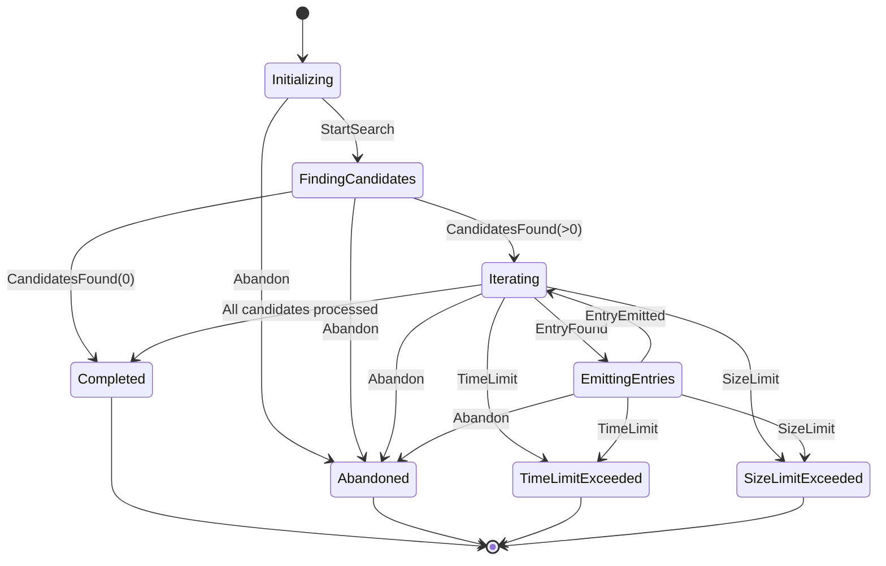
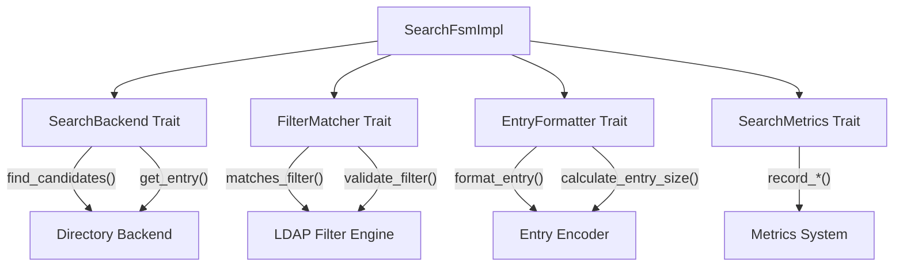

# Search FSM Documentation

## Overview

The Search Finite State Machine (`SearchFsmImpl`) manages comprehensive LDAP search operations with support for all LDAP search features including complex filtering, size/time limits, attribute projection, and resource management. The FSM follows the established pattern of using trait abstractions for external dependencies and comprehensive error handling.

## Architecture

### State Diagram



### Component Architecture



## Key Components

### 1. Search FSM Implementation (`SearchFsmImpl`)

The main FSM implementation manages:
- **Search lifecycle**: Parameter validation, candidate discovery, entry iteration
- **Resource limits**: Size limits, time limits, candidate limits
- **Error handling**: Abandonment, timeouts, backend failures
- **Statistics**: Performance tracking, operational metrics

### 2. External Dependencies (Trait Abstractions)

#### SearchBackend Trait
```rust
#[async_trait]
pub trait SearchBackend: Send + Sync {
    async fn find_candidates(&self, base_dn: &str, scope: i32, filter: &str) -> Result<Vec<String>, String>;
    async fn get_entry(&self, dn: &str, attributes: &[String]) -> Result<Option<SearchEntry>, String>;
    async fn entry_exists(&self, dn: &str) -> Result<bool, String>;
    async fn get_search_stats(&self, base_dn: &str) -> Result<(usize, usize), String>;
}
```

#### FilterMatcher Trait
```rust
#[async_trait]
pub trait FilterMatcher: Send + Sync {
    async fn matches_filter(&self, entry: &SearchEntry, filter: &str) -> Result<bool, String>;
    async fn validate_filter(&self, filter: &str) -> Result<(), String>;
    fn extract_indexed_attributes(&self, filter: &str) -> Vec<String>;
}
```

#### EntryFormatter Trait
```rust
#[async_trait]
pub trait EntryFormatter: Send + Sync {
    async fn format_entry(&self, entry: &SearchEntry, requested_attributes: &[String]) -> Result<Vec<u8>, String>;
    async fn calculate_entry_size(&self, entry: &SearchEntry, requested_attributes: &[String]) -> Result<usize, String>;
}
```

#### SearchMetrics Trait
```rust
pub trait SearchMetrics: Send + Sync {
    fn record_search_start(&self, params: &SearchParams);
    fn record_candidates_found(&self, count: usize);
    fn record_entry_processed(&self, dn: &str, matched: bool);
    fn record_search_complete(&self, result_code: &SearchResultCode, entries_sent: usize, duration: Duration);
    fn record_search_abandoned(&self);
    fn get_stats(&self) -> (u64, u64, f64);
}
```

### 3. Data Structures

#### SearchEntry
Represents an LDAP entry for search operations:
```rust
pub struct SearchEntry {
    pub dn: String,
    pub attributes: HashMap<String, Vec<String>>,
    pub object_classes: Vec<String>,
}
```

#### SearchSession
Tracks active search state:
```rust
pub struct SearchSession {
    pub params: SearchParams,
    pub start_time: Instant,
    pub candidates: Vec<String>,
    pub candidate_index: usize,
    pub entries_sent: usize,
    // ... additional tracking fields
}
```

#### SearchFsmConfig
Configuration for FSM behavior:
```rust
pub struct SearchFsmConfig {
    pub default_size_limit: u32,
    pub default_time_limit: u32,
    pub max_size_limit: u32,
    pub max_time_limit: u32,
    pub max_candidates: usize,
    pub candidate_batch_size: usize,
}
```

## Search Operation Flow

### 1. Search Initialization
1. **Parameter Validation**: Base DN, scope, filter syntax, limits
2. **Default Application**: Apply default size/time limits if not specified
3. **Session Creation**: Initialize `SearchSession` with parameters
4. **Metrics Recording**: Log search start

### 2. Candidate Discovery
1. **Backend Query**: Call `SearchBackend::find_candidates()`
2. **Result Handling**: Process candidate DNs or handle empty results
3. **Metrics Recording**: Log candidates found
4. **State Transition**: Move to `Iterating` or `Completed`

### 3. Entry Processing
1. **Batch Processing**: Process candidates in configurable batches
2. **Entry Retrieval**: Call `SearchBackend::get_entry()` for each candidate
3. **Filter Evaluation**: Call `FilterMatcher::matches_filter()`
4. **Entry Formatting**: Call `EntryFormatter::format_entry()`
5. **Limit Checking**: Validate size/time limits before emission

### 4. Search Completion
1. **Final State**: Transition to appropriate terminal state
2. **Metrics Recording**: Log final statistics
3. **Resource Cleanup**: Clear session data
4. **Result Code**: Return appropriate LDAP result code

## Configuration Options

### Size and Time Limits
```rust
SearchFsmConfig {
    default_size_limit: 1000,      // Default max entries
    default_time_limit: 30,        // Default max seconds
    max_size_limit: 10000,         // Administrator max entries
    max_time_limit: 300,           // Administrator max seconds (5 min)
    max_candidates: 50000,         // Max candidates to process
    candidate_batch_size: 100,     // Batch size for candidate processing
}
```

### Caching Strategy
Search FSM does not own a result cache. Production caching is delegated to the backend layer, such as LMDB's bounded exact-DN entry cache, because a safe FSM-level search result cache would need keys that include base DN, scope, normalized filter, requested attributes, `typesOnly`, controls, security context, and data freshness/version state. Keeping the FSM cache-free avoids stale result sets and cross-context leakage while still allowing backend implementations to cache exact-DN reads safely.

### Usage Patterns

#### Basic Search
```rust
let backend = Box::new(MySearchBackend::new());
let filter_matcher = Box::new(MyFilterMatcher::new());
let entry_formatter = Box::new(MyEntryFormatter::new());

let mut fsm = SearchFsmImpl::new(backend, filter_matcher, entry_formatter);

// Start search operation
let result = fsm.handle_event(SearchEvent::StartSearch {
    base_dn: "dc=example,dc=org".to_string(),
    scope: 2, // Subtree search
    filter: "(objectClass=person)".to_string(),
    attributes: vec!["cn".to_string(), "mail".to_string()],
    size_limit: 100,
    time_limit: 30,
}).await?;
```

#### Search with Custom Configuration
```rust
let config = SearchFsmConfig {
    default_size_limit: 50,
    default_time_limit: 60,
    max_size_limit: 5000,
    max_time_limit: 600,
    max_candidates: 10000,
    candidate_batch_size: 50,
};

let fsm = SearchFsmImpl::with_config(backend, filter_matcher, entry_formatter, config);
```

#### Search with Metrics
```rust
let metrics = Box::new(MySearchMetrics::new());
let fsm = SearchFsmImpl::new(backend, filter_matcher, entry_formatter)
    .with_metrics(metrics);
```

## Error Handling

### Error Types
The FSM defines comprehensive error types:

```rust
pub enum SearchFsmError {
    InvalidParameters { message: String },
    BackendError { message: String },
    FilterError { message: String },
    FormattingError { message: String },
    Abandoned,
    TimeLimitExceeded,
    SizeLimitExceeded,
    InvalidStateTransition { from: SearchState, to: SearchState },
    NoActiveSearch,
    Generic { message: String },
}
```

### Error Recovery
- **Backend Errors**: Propagated as `SearchFsmError::BackendError`
- **Filter Errors**: Caught during validation and evaluation
- **Resource Limits**: Graceful degradation with partial results
- **Abandonment**: Clean resource cleanup and state reset

## Performance Considerations

### Optimization Strategies
1. **Batch Processing**: Process candidates in configurable batches
2. **Early Termination**: Stop processing when limits reached
3. **Indexed Attributes**: Extract attributes that benefit from indexing
4. **Statistics Collection**: Monitor performance for optimization
5. **Memory Management**: Efficient candidate list management

### Scalability Features
- **Configurable Limits**: Prevent resource exhaustion
- **Metrics Integration**: Performance monitoring and alerting
- **Cancellation Support**: Abandon long-running searches
- **Backend Abstraction**: Support for different storage implementations

## Testing

The Search FSM includes comprehensive tests:

### Unit Tests
- **State Transitions**: All valid state transitions
- **Event Handling**: All search events and error conditions
- **Limit Enforcement**: Size and time limit validation
- **Error Scenarios**: Backend failures, invalid parameters
- **Trait Implementations**: All FSM trait implementations

### Mock Implementations
Complete mock implementations for testing:
- `MockSearchBackend`: Configurable backend simulation
- `MockFilterMatcher`: Filter evaluation simulation
- `MockEntryFormatter`: Entry formatting simulation
- `MockSearchMetrics`: Metrics collection simulation

### Test Coverage
- **Happy Path**: Successful search operations
- **Error Conditions**: All error types and recovery
- **Edge Cases**: Empty results, limit edge cases
- **Performance**: Large result sets and resource limits

## Integration Points

### LDAP Server Integration
The Search FSM integrates with the LDAP server through:
1. **Server Event Loop**: Handles incoming search requests
2. **Backend Interface**: Connects to directory storage
3. **Response Encoding**: Formats LDAP search responses
4. **Metrics Collection**: Server-wide performance monitoring

### Backend Integration
The FSM works with various backend implementations:
- **Mock Backend**: For development and testing
- **Memory Backend**: For simple in-memory storage
- **Database Backend**: For persistent storage (future)
- **Distributed Backend**: For clustered deployments (future)

## Future Enhancements

### Planned Features
1. **Search Result Caching**: Improve performance for repeated searches
2. **Pagination Support**: Handle large result sets efficiently
3. **Parallel Processing**: Concurrent candidate processing
4. **Query Optimization**: Advanced filter optimization
5. **Resource Monitoring**: Enhanced memory and CPU tracking

### Extension Points
- **Custom Backends**: Plugin architecture for storage systems
- **Filter Extensions**: Custom filter function support
- **Formatter Plugins**: Multiple output format support
- **Metrics Integrations**: Support for various monitoring systems

---

**See Also:**
- [FSM Architecture Overview](./architecture-overview.md)
- [Auth FSM Documentation](./auth_fsm.md)
- [BER Decoder FSM Documentation](./ber_decoder_fsm.md)
- [Connection FSM Documentation](./connection_fsm.md)
