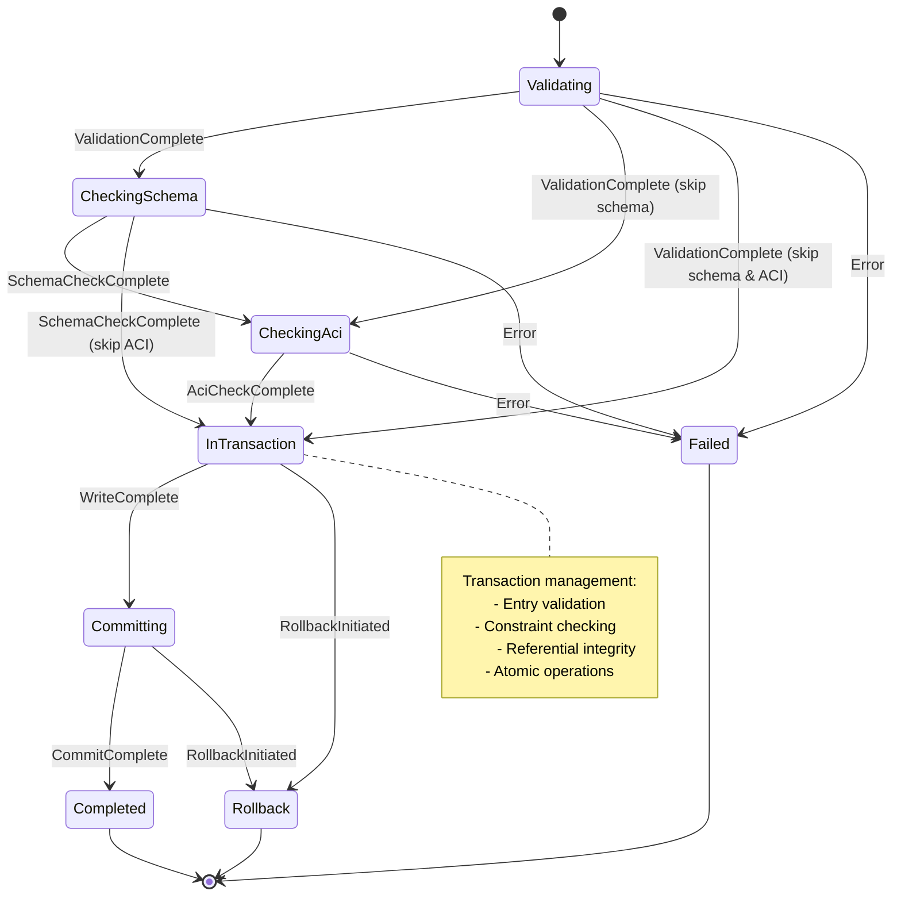
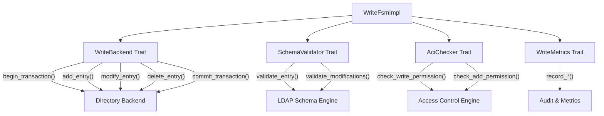

# Write FSM Documentation

## Overview

The Write Finite State Machine (`WriteFsmImpl`) manages comprehensive LDAP write operations including Add, Modify, ModifyDN, and Delete operations. The FSM provides complete transaction management, schema validation, access control enforcement, and comprehensive error handling with audit logging capabilities.

## Architecture

### State Diagram



### Component Architecture



## Key Components

### 1. Write FSM Implementation (`WriteFsmImpl`)

The main FSM implementation manages:
- **Operation validation**: Parameter validation and preprocessing
- **Schema compliance**: LDAP schema validation and constraint checking
- **Access control**: User permission evaluation and enforcement
- **Transaction management**: Atomic operations with commit/rollback support
- **Audit logging**: Complete operation tracking and metrics collection

### 2. External Dependencies (Trait Abstractions)

#### WriteBackend Trait
```rust
#[async_trait]
pub trait WriteBackend: Send + Sync {
    async fn begin_transaction(&self) -> Result<String, String>;
    async fn commit_transaction(&self, txn_id: &str) -> Result<(), String>;
    async fn rollback_transaction(&self, txn_id: &str, reason: &str) -> Result<(), String>;
    async fn validate_entry(&self, dn: &str, entry: &[u8]) -> Result<(), String>;
    async fn add_entry(&self, txn_id: &str, dn: &str, entry: &[u8]) -> Result<(), String>;
    async fn modify_entry(&self, txn_id: &str, dn: &str, modifications: &[Modification]) -> Result<(), String>;
    async fn modify_dn(&self, txn_id: &str, dn: &str, new_rdn: &str, delete_old: bool, new_superior: Option<&str>) -> Result<(), String>;
    async fn delete_entry(&self, txn_id: &str, dn: &str) -> Result<(), String>;
    async fn entry_exists(&self, dn: &str) -> Result<bool, String>;
}
```

#### SchemaValidator Trait
```rust
#[async_trait]
pub trait SchemaValidator: Send + Sync {
    async fn validate_entry(&self, entry: &WriteEntry) -> Result<(), String>;
    async fn validate_modifications(&self, dn: &str, modifications: &[Modification]) -> Result<(), String>;
    async fn validate_dn_modification(&self, dn: &str, new_rdn: &str, new_superior: Option<&str>) -> Result<(), String>;
    fn is_object_class_defined(&self, object_class: &str) -> bool;
}
```

#### AciChecker Trait
```rust
#[async_trait]
pub trait AciChecker: Send + Sync {
    async fn check_write_permission(&self, user_dn: Option<&str>, operation: &WriteOperation) -> Result<(), String>;
    async fn check_add_permission(&self, user_dn: Option<&str>, entry_dn: &str, entry: &WriteEntry) -> Result<(), String>;
    async fn check_modify_permission(&self, user_dn: Option<&str>, entry_dn: &str, modifications: &[Modification]) -> Result<(), String>;
    async fn check_delete_permission(&self, user_dn: Option<&str>, entry_dn: &str) -> Result<(), String>;
}
```

#### WriteMetrics Trait
```rust
pub trait WriteMetrics: Send + Sync {
    fn record_write_start(&self, user_dn: Option<&str>, operation: &WriteOperation);
    fn record_validation_complete(&self, operation_type: &str, duration: Duration);
    fn record_schema_check_complete(&self, operation_type: &str, duration: Duration);
    fn record_aci_check_complete(&self, operation_type: &str, duration: Duration);
    fn record_transaction_started(&self, txn_id: &str);
    fn record_write_complete(&self, operation: &WriteOperation, result_code: &WriteResultCode, duration: Duration);
    fn record_write_rollback(&self, operation: &WriteOperation, reason: &str);
    fn get_stats(&self) -> (u64, u64, u64);
}
```

### 3. Data Structures

#### WriteEntry
Represents an LDAP entry for write operations:
```rust
pub struct WriteEntry {
    pub dn: String,
    pub attributes: HashMap<String, Vec<String>>,
    pub object_classes: Vec<String>,
    pub binary_attributes: HashMap<String, Vec<Vec<u8>>>,
}
```

#### Modification
Represents modifications to an entry:
```rust
pub enum Modification {
    Add { name: String, values: Vec<String> },
    Delete { name: String, values: Vec<String> },
    Replace { name: String, values: Vec<String> },
}
```

#### WriteSession
Tracks active write operation state:
```rust
pub struct WriteSession {
    pub operation: WriteOperation,
    pub user_dn: Option<String>,
    pub start_time: Instant,
    pub transaction_id: Option<String>,
    pub validation_start: Option<Instant>,
    pub schema_check_start: Option<Instant>,
    pub aci_check_start: Option<Instant>,
    pub transaction_start: Option<Instant>,
    pub can_rollback: bool,
}
```

#### WriteFsmConfig
Configuration for FSM behavior:
```rust
pub struct WriteFsmConfig {
    pub default_transaction_timeout: u32,
    pub max_transaction_timeout: u32,
    pub strict_schema_validation: bool,
    pub enable_aci_checks: bool,
    pub max_entry_size: usize,
    pub max_modifications_per_request: usize,
    pub enable_audit_logging: bool,
}
```

## Write Operation Flow

### 1. Operation Validation
1. **Parameter Validation**: DN, entry data, operation-specific constraints
2. **Size Limits**: Entry size and modification count validation
3. **Format Validation**: LDIF parsing and attribute validation
4. **Precondition Checks**: Entry existence and dependency validation

### 2. Schema Validation (Optional)
1. **Object Class Validation**: Required and auxiliary object classes
2. **Attribute Validation**: Mandatory attributes and value constraints
3. **Syntax Validation**: Attribute value format and encoding
4. **Structural Rules**: DIT structure and naming constraints

### 3. Access Control Evaluation (Optional)
1. **User Authentication**: Verify authenticated identity
2. **Permission Checks**: Operation-specific access control
3. **Resource Authorization**: Entry-level access permissions
4. **Attribute Authorization**: Attribute-level access control

### 4. Transaction Management
1. **Transaction Start**: Begin atomic transaction
2. **Operation Execution**: Perform write operation
3. **Constraint Validation**: Referential integrity and uniqueness
4. **Commit/Rollback**: Complete or abort transaction

## Supported Write Operations

### Add Operation
Creates new directory entries with full validation:
```rust
WriteOperation::Add {
    dn: "cn=newuser,ou=people,dc=example,dc=org".to_string(),
    entry: ldif_data, // LDIF-encoded entry
}
```

### Modify Operation
Updates existing entries with tracked modifications:
```rust
WriteOperation::Modify {
    dn: "cn=user,ou=people,dc=example,dc=org".to_string(),
    changes: modification_data, // Encoded modifications
}
```

### ModifyDN Operation
Renames or moves entries with referential integrity:
```rust
WriteOperation::ModifyDn {
    dn: "cn=oldname,ou=people,dc=example,dc=org".to_string(),
    new_rdn: "cn=newname".to_string(),
    delete_old: true,
    new_superior: Some("ou=staff,dc=example,dc=org".to_string()),
}
```

### Delete Operation
Removes entries with dependency checking:
```rust
WriteOperation::Delete {
    dn: "cn=user,ou=people,dc=example,dc=org".to_string(),
}
```

## Configuration Options

### Transaction Management
```rust
WriteFsmConfig {
    default_transaction_timeout: 30,     // Default timeout (seconds)
    max_transaction_timeout: 300,        // Maximum timeout (5 minutes)
    strict_schema_validation: true,      // Enable schema validation
    enable_aci_checks: true,              // Enable access control
    max_entry_size: 1_048_576,           // Max entry size (1MB)
    max_modifications_per_request: 1000, // Max modifications per request
    enable_audit_logging: true,          // Enable audit logging
}
```

### Usage Patterns

#### Basic Write Operation
```rust
let backend = Box::new(MyWriteBackend::new());
let schema_validator = Box::new(MySchemaValidator::new());
let aci_checker = Box::new(MyAciChecker::new());

let mut fsm = WriteFsmImpl::new(backend, schema_validator, aci_checker);

// Start add operation
let result = fsm.handle_event(WriteEvent::StartWrite(WriteOperation::Add {
    dn: "cn=newuser,ou=people,dc=example,dc=org".to_string(),
    entry: ldif_data.into_bytes(),
})).await?;

// Progress through validation stages
fsm.handle_event(WriteEvent::ValidationComplete).await?;
fsm.handle_event(WriteEvent::SchemaCheckComplete).await?;
fsm.handle_event(WriteEvent::AciCheckComplete).await?;

// Complete transaction
fsm.handle_event(WriteEvent::WriteComplete).await?;
fsm.handle_event(WriteEvent::CommitComplete).await?;
```

#### Write with Custom Configuration
```rust
let config = WriteFsmConfig {
    default_transaction_timeout: 60,
    max_transaction_timeout: 600,
    strict_schema_validation: false,     // Skip schema validation
    enable_aci_checks: false,            // Skip access control
    max_entry_size: 2_097_152,           // 2MB max entry
    max_modifications_per_request: 2000,
    enable_audit_logging: true,
};

let fsm = WriteFsmImpl::with_config(backend, schema_validator, aci_checker, config);
```

#### Write with Metrics
```rust
let metrics = Box::new(MyWriteMetrics::new());
let fsm = WriteFsmImpl::new(backend, schema_validator, aci_checker)
    .with_metrics(metrics);
```

## Error Handling

### Error Types
The FSM defines comprehensive error types:

```rust
pub enum WriteFsmError {
    InvalidOperation { message: String },
    BackendError { message: String },
    SchemaError { message: String },
    AccessDenied { message: String },
    TransactionError { message: String },
    EntryAlreadyExists { dn: String },
    NoSuchObject { dn: String },
    ConstraintViolation { message: String },
    InvalidStateTransition { from: WriteState, to: WriteState },
    NoActiveOperation,
    Generic { message: String },
}
```

### Error Recovery
- **Validation Errors**: Caught during parameter validation
- **Schema Errors**: Handled during schema compliance checking
- **Access Denied**: Managed by access control evaluation
- **Transaction Errors**: Automatic rollback with cleanup
- **Constraint Violations**: Referential integrity enforcement

## Performance Considerations

### Optimization Strategies
1. **Transaction Batching**: Group related operations into single transactions
2. **Schema Caching**: Cache schema definitions for repeated validation
3. **Permission Caching**: Cache access control decisions
4. **Lazy Validation**: Skip unnecessary validation steps when safe
5. **Metrics Collection**: Monitor performance for optimization opportunities

### Scalability Features
- **Configurable Validation**: Optional schema and ACI checking
- **Transaction Timeouts**: Prevent long-running operations
- **Entry Size Limits**: Control memory usage
- **Audit Integration**: Comprehensive operation logging
- **Backend Abstraction**: Support for different storage implementations

## Testing

The Write FSM includes comprehensive tests:

### Unit Tests
- **State Transitions**: All valid write operation flows
- **Event Handling**: All write events and error conditions
- **Validation Logic**: Parameter and operation validation
- **Transaction Management**: Commit and rollback scenarios
- **Error Scenarios**: Backend failures, constraint violations
- **Trait Implementations**: All FSM trait implementations

### Mock Implementations
Complete mock implementations for testing:
- `MockWriteBackend`: Configurable backend simulation
- `MockSchemaValidator`: Schema validation simulation
- `MockAciChecker`: Access control simulation
- `MockWriteMetrics`: Metrics collection simulation

### Test Coverage
- **Happy Path**: Successful write operations for all operation types
- **Error Conditions**: All error types and recovery scenarios
- **Edge Cases**: Empty entries, large modifications, constraint violations
- **Performance**: Transaction timeouts and resource limits

## Integration Points

### LDAP Server Integration
The Write FSM integrates with the LDAP server through:
1. **Server Event Loop**: Handles incoming write requests
2. **Backend Interface**: Connects to directory storage
3. **Transaction Coordination**: Ensures ACID properties
4. **Audit Logging**: Server-wide operation tracking

### Backend Integration
The FSM works with various backend implementations:
- **Mock Backend**: For development and testing
- **Memory Backend**: For simple in-memory storage
- **Database Backend**: For persistent storage (future)
- **Distributed Backend**: For clustered deployments (future)

## Future Enhancements

### Planned Features
1. **Batch Operations**: Multi-entry atomic transactions
2. **Conflict Resolution**: Optimistic concurrency control
3. **Change Tracking**: Detailed modification history
4. **Replication Support**: Change log generation
5. **Performance Monitoring**: Enhanced metrics and alerting

### Extension Points
- **Custom Validators**: Plugin architecture for validation
- **Backend Plugins**: Support for different storage systems
- **Transformation Plugins**: Entry modification pipelines
- **Audit Plugins**: Flexible audit logging backends

---

**See Also:**
- [FSM Architecture Overview](./architecture-overview.md)
- [Search FSM Documentation](./search_fsm.md)
- [Auth FSM Documentation](./auth_fsm.md)
- [BER Decoder FSM Documentation](./ber_decoder_fsm.md)
- [Connection FSM Documentation](./connection_fsm.md)